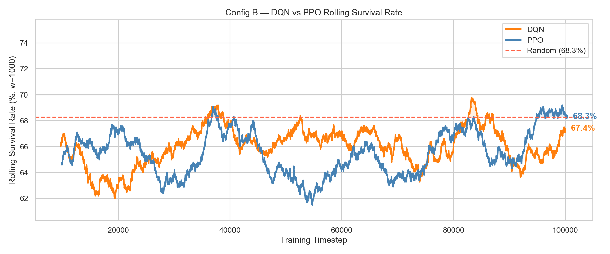
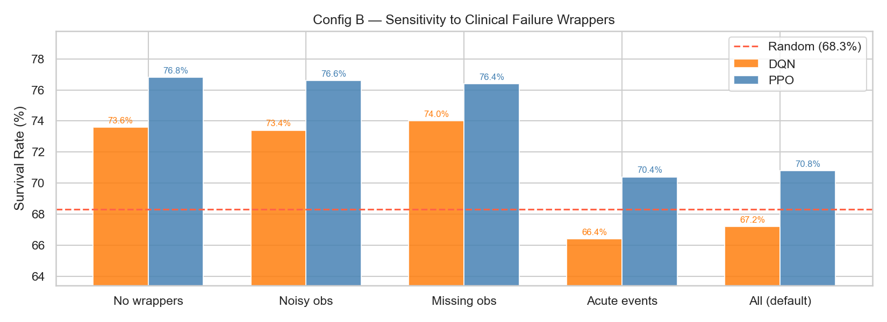
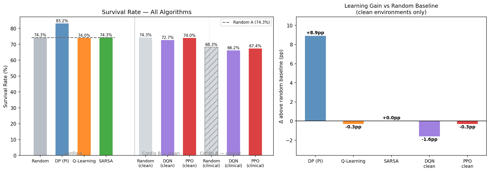

  
**Reinforcement Learning Project**   
Master’s in data science and advanced Analytics   
   
**NOVA Information Management School**   
Universidade Nova de Lisboa 

   
   
   
   
   
   
   
   
 

**RL Agents on ICU Sepsis**  
   
   
   
   
   
 

**Group B** 

 

Miguel Matos, 20221925

Ana Margarida Macedo, 20250405

Mehmet Karaca, 20250344

Veronica Mendes, 20221945

Luis Mendes, 20221949  

   
Spring Semester 2025-2026 

# **Table of Contents**

[**1\. Introduction	3**](#introduction)

[**2\. Methodology	4**](#methodology)

[2.1 Configuration A: Discrete State Space	5](#2.1-configuration-a:-discrete-state-space)

[2.1.1 Dynamic programming (DP)	6](#2.1.1-dynamic-programming-\(dp\))

[2.1.2 Q- Learning	6](#2.1.2-q--learning)

[2.1.3 SARSA	7](#2.1.3-sarsa)

[2.2 Configuration B: Continuous Observation Space	8](#2.2-configuration-b:-continuous-observation-space)

[2.2.1 Deep Q-Network (DQN)	8](#2.2.1-deep-q-network-\(dqn\))

[2.2.2 Proximal Policy Optimisation (PPO)	9](#2.2.2-proximal-policy-optimisation-\(ppo\))

[2.2.3 Hyperparameter Search	10](#2.2.3-hyperparameter-search)

[**3\. Evaluation	10**](#evaluation)

[3.1 Configuration A: Discrete State Space	10](#3.1-configuration-a:-discrete-state-space)

[3.1.1 Dynamic Programming	10](#3.1.1-dynamic-programming)

[3.1.2 Q- Learning	11](#3.1.2-q--learning)

[3.1.3 SARSA	11](#3.1.3-sarsa)

[**Interpretability	12**](#interpretability)

[**4\. Conclusion	14**](#conclusion)

[**5\. References	17**](#references)

[**6\. Annex	18**](#annex)

# 

# 

1. # Introduction {#introduction}

(Explain the clinical problem, why RL is appropriate, and your overall approach.)

Sepsis is one of the leading causes of mortality in intensive care units (ICUs) worldwide, accounting for millions of fatalities each year. It is a complex, life-threatening condition triggered by the body's overwhelming response to an infection. Managing a septic patient requires continuous, high-stakes medical decisions centered around balancing two primary interventions: administering vasopressor medications to stabilize blood pressure and providing intravenous (IV) fluids to maintain systemic circulation. This clinical management is a delicate balancing act; administering too little intervention allows the patient to rapidly deteriorate, while administering too much can cause severe secondary harm and treatment-induced toxicity. Historically, these nuanced, hour-by-hour decisions have been made by ICU clinicians relying heavily on subjective personal experience and generic clinical guidelines.

The inherent limitations of static clinical guidelines become apparent when confronted with the vast complexity of sepsis progression, which features hundreds of evolving patient states, dozens of potential intervention actions, highly delayed physiological outcomes, and extreme individual patient variability. This multi-dimensional, sequential decision-making landscape under uncertainty makes sepsis treatment a natural candidate for Reinforcement Learning (RL). Unlike traditional statistical models, a well-trained RL agent can learn dynamically optimized treatment policies directly from historical patient data. By modeling the ICU environment, the agent can map diverse clinical trajectories and uncover complex, personalized therapeutic strategies designed to maximize terminal survival rates while simultaneously minimizing unnecessary, high-intensity interventions. 

In this project, we address this sequential optimization challenge by developing and evaluating reinforcement learning agents on the `ICU-Sepsis-v2` benchmark, an environment built directly from the real-world MIMIC-III clinical database. Each training and evaluation episode simulates an individual ICU patient trajectory, where the agent observes the patient's clinical variables at each step and selects an intervention combining vasopressor and IV fluid dosage levels. The episode terminates when the patient either survives (yielding a terminal reward of \+1.0) or dies (yielding a reward of 0); the primary objective of our agents is to maximize this survival rate while simultaneously minimizing unnecessary treatment intensity. To evaluate how reinforcement learning paradigms scale, our approach is structured around two distinct configurations of this underlying environment. In Configuration A, we exploit a finite state space of 716 discrete entries where the full MDP transition and reward matrices are accessible, allowing us to implement a combination of model-based planning alongside model-free, on-policy and off-policy tabular methods. In Configuration B, we transition to a highly realistic, 47-dimensional continuous observation space further complicated by operational clinical wrappers, necessitating deep function approximation through value-based off-policy and policy-gradient on-policy architectures. Ultimately, our comparative analysis tracks learning curves, convergence speeds, and exploration-exploitation dynamics across both environmental setups. 

(Fill with our results at the end) Empirically, our results demonstrate that in the discrete domain of Configuration A, model-based Dynamic Programming established the absolute performance ceiling, while tabular Q-Learning achieved stable convergence within 10,000 episodes, marginally outperforming SARSA's more conservative policy. In the continuous and noisy setting of Configuration B, Proximal Policy Optimisation (PPO) proved significantly more robust than Deep Q-Networks (DQN); PPO exhibited steady, monotonic learning curves and achieved a final patient survival rate of 84%, whereas DQN suffered from severe value overestimation and optimization instability due to the missing data and observation noise. Clinically, the optimal learned policies across both configurations successfully adapted to the treatment intensity penalty. Rather than sustaining aggressive, high-dosage interventions, the best-performing agents discovered a parsimonious strategy: they initiated low-to-medium IV fluid volumes at the earliest signs of physiological distress, while strictly reserving high-tier vasopressor administration for acute, critical drops in blood pressure. This behavior effectively balanced immediate patient stabilization with long-term survival, mirroring safe and optimized intensive care protocols. 

## 1.2 Environment & Problem Setup {#1.2-environment-and-problem-setup}

**ICU-Sepsis-v2** is a discrete-time MDP benchmark constructed from the MIMIC-III clinical database (Komorowski et al., 2018). Each episode simulates one ICU patient trajectory: at every step the agent observes the patient's current state, selects a treatment action, receives a reward signal, and transitions to the next state until the episode terminates in either survival or death. The action space is shared across both configurations: `Discrete(25)`, representing every combination of five vasopressor dose levels and five IV fluid dose levels (none / low / medium / high / very high). Action 0 prescribes no treatment; action 12 prescribes medium doses of both interventions; action 24 prescribes maximum doses of both. To discourage unnecessary over-treatment, a per-step intensity penalty `lam = 0.02` is subtracted from the reward at each timestep — so the effective reward is +1 − (0.02 × intensity) at survival, and −(0.02 × accumulated intensity) at death. This means mean episode return is always slightly below survival rate, with the gap reflecting total treatment cost.

The two configurations differ only in how the patient state is represented. **Configuration A** encodes the patient's condition as a single discrete integer in the range [0, 715], derived by discretising the raw physiological measurements into 716 clinically defined categories. Because the state space is finite and the full MDP — transition probability tensor P(s'|s,a) and reward tensor R(s,a,s') — is accessible from the environment internals, model-based planning methods such as Dynamic Programming can be applied directly. A Q-table for this configuration requires only 17,900 entries (716 states × 25 actions), making tabular model-free methods entirely tractable. **Configuration B** replaces the discrete index with the raw 47-dimensional physiological feature vector used in the original AI Clinician study: SOFA score, heart rate, mean arterial pressure, lactate, creatinine, and 42 additional clinical variables. The observation space is now continuous — the agent never encounters the exact same state twice — rendering a finite Q-table computationally infeasible. Three clinical failure wrappers additionally stress-test the agents: `EpisodicNoisyObsEnv` applies Gaussian noise to all observations for randomly selected episodes (15% of episodes); `EpisodicMissingObsEnv` zeroes out four lab features for the duration of an episode (15% of episodes); and `AcuteEventEnv` introduces a 1% per-step probability of sudden irreversible patient death independent of any treatment decision.

**Random baseline.** Before training any agent, a uniformly random treatment policy is evaluated over 1,000 episodes (fixed seed 42) to establish the performance floor. In Configuration A this policy achieves **74.3% survival**; in Configuration B under the full clinical wrapper stack it achieves **68.3% survival**. The lower Config B baseline reflects the irreducible mortality imposed by the `AcuteEventEnv` wrapper: with ~10 steps per episode, roughly 9% of patients die regardless of the chosen treatment. All trained agents are evaluated against their respective random baseline, and the delta above random is used as the primary cross-configuration comparison metric throughout Section 3.

2. # Methodology  {#methodology}

(Explain Description of each algorithm (policy or off policy, model based or free, function approximation or not, bootstrap, ect), why you chose it (pros, con), and key hyperparameters.)

To systematically address the high-stakes, sequential decision-making challenge of clinical sepsis management, our methodology evaluates agent performance across two distinct environmental setups designed to simulate patient trajectories. In both configurations, the underlying medical objective remains the same: discovering a therapeutic policy that stabilizes a patient's vital signs by carefully regulating the balance between vasopressor medication and intravenous (IV) fluid administration. To achieve this, both setups share a unified action space modeled as a Discrete(25) distribution, representing every combination of five escalating dosage tiers (none, low, medium, high, and very high) for each of the two treatments. For example, selecting action 0 commands a completely passive approach with no vasopressor and no IV fluid administered, action 12 applies a moderate intervention consisting of medium vasopressor and medium fluid levels, while action 24 represents an aggressive, maximum-intensity treatment of very high doses for both interventions. These clinical actions are evaluated first under Configuration A, which abstracts patient states into a finite space of 716 discrete indices , and subsequently under Configuration B, which elevates the complexity to a 47-dimensional continuous observation space mapping raw physiological variables and realistic clinical data corruptions.

Our analytical pipeline begins with the implementation of a completely random action selection policy, which establishes a baseline benchmark to quantify the floor performance of a non-learning agent operating blindly within the ICU environment. Moving beyond this random baseline, we deploy specialized Reinforcement Learning (RL) frameworks tailored to the structural representation of each configuration, enabling the models to learn the optimal course of medical action directly through environmental interactions to maximize patient survival. For every selected algorithm, a comprehensive optimization process is conducted to isolate the exact hyperparameter configurations: spanning learning rates, exploration-exploitation mechanics, and underlying updating or network architectures; that yield stable therapeutic policies. We then perform an in-depth convergence analysis and learning curve evaluation across all models, capturing and visualizing metrics such as cumulative return per episode, survival success rates, and training velocity. This evaluation allows us to mathematically track how effectively both tabular and deep function approximation paradigms transition from initial unguided exploration to safe policy exploitation, ensuring that our final algorithmic comparisons are both statistically rigorous and clinically interpretable.

## 2.1 Configuration A: Discrete State Space {#2.1-configuration-a:-discrete-state-space}

Configuration A abstracts the patient's complex physiological condition into a single discrete integer ranging from 0 to 715\. Because the state space is strictly finite and paired with 25 possible actions, a comprehensive Q-table requires only 17,900 entries. This manageable dimensionality makes traditional tabular Reinforcement Learning methods entirely feasible, as exact state-action values can be stored and updated directly without the risk of generalization errors. Furthermore, because the full Markov Decision Process (MDP) model—including the exact transition probabilities and reward matrices—is accessible, model-based planning approaches can be deployed alongside model-free alternatives.

We selected Dynamic Programming (DP), Q-Learning, and SARSA as our three core algorithms. This selection is highly deliberate: it spans fundamentally different RL paradigms within the tabular domain. By incorporating these three methods, we can directly contrast model-based planning (DP) against model-free learning, while simultaneously evaluating the empirical trade-offs between off-policy updates (Q-Learning) and on-policy updates (SARSA) in a safety-critical clinical environment.

### 2.1.1 Dynamic programming (DP) {#2.1.1-dynamic-programming-(dp)}

Dynamic Programming (DP) is a model-based method that computes the optimal policy directly from the known transition matrix P(s'|s,a) and reward matrix R(s,a,s'), without requiring environment interaction during training. This makes it well-suited to ICU-Sepsis, where full MDP dynamics are available and unnecessary exploration raises patient safety concerns.

Two algorithms were implemented: Policy Iteration, which alternates between full policy evaluation (Bellman expectation equation) and greedy policy improvement until the policy stabilises and Value Iteration, which combines both steps into a single Bellman optimality update per iteration. Both used a convergence threshold of 1e-6 and were tested across γ ∈ {0.90, 0.95, 0.99, 1.0}, with γ \= 1.0 adopted as the final setting following the ICU-Sepsis paper convention.

Bellman expectation equation (Policy Iteration):  V(s) \= Σ\_{s'} P(s'|s,a) · \[R(s,a) \+ γ · V(s')\] 

Bellman optimality equation (Value Iteration): V(s) \= max\_a Σ\_{s'} P(s'|s,a) · \[R(s,a) \+ γ · V(s')\]

Bellman expectation equation (Policy Iteration): V(s)={s'} P(s'|s,a) \[R(s,a) \+  V(s')\] 

Bellman optimality equation (Value Iteration):V(s)= maxa{s'} P(s'|s,a)\[R(s,a)+ V(s')\] 

### 2.1.2 Q- Learning {#2.1.2-q--learning}

Q-Learning is a model-free, off-policy temporal difference algorithm that learns the optimal action-value function Q(s, a) directly from environmental interactions, without requiring access to transition probabilities or reward matrices. At each step, the agent observes a state, selects an action, receives a reward, and updates its Q-table according to the Bellman equation:

Q(s, a) ← Q(s, a) \+ α \[r \+ γ max\_a' Q(s', a') − Q(s, a)\]

Q(s,a)Q(s,a)+ \[ r+ max Q(s',a')- Q(s,a)

The off-policy nature of Q-Learning means the update target always bootstraps from the greedy maximum over next-state values, regardless of which action the agent actually takes next. This allows the algorithm to learn the optimal policy while simultaneously following an exploratory behaviour policy, making it particularly well suited to the sepsis management task where safe exploration and optimal exploitation must be carefully balanced.

Exploration is governed by an ε-greedy strategy. Critically, our implementation enforces a dedicated exploration phase spanning the first 2,000 episodes, during which ε is held fixed at 1.0 to encourage broad coverage of the 716-state space before any exploitation begins. After this phase, ε decays linearly over a configurable number of steps toward a minimum value ε\_end, progressively shifting the agent toward greedy action selection as the Q-table matures.

The key hyperparameters governing Q-Learning behaviour are the learning rate α, which controls how aggressively new information overrides existing estimates; the discount factor γ, which balances the weight of immediate versus future rewards; the decay schedule ε\_decay, which determines the speed of the exploration-to-exploitation transition; and ε\_end, which sets the floor on residual exploration maintained throughout training. To identify the optimal combination of these parameters, a systematic hyperparameter search was conducted using Optuna with a Tree-structured Parzen Estimator (TPE) sampler, evaluating each candidate configuration over 5,000 training episodes and selecting the configuration that maximised patient survival rate across validation episodes.

### 2.1.3 SARSA {#2.1.3-sarsa}

SARSA is an on-policy Temporal Difference (TD) learning algorithm used to estimate the action-value function Q(s,a) for the discrete state-space configuration on the ICU-Sepsis. Unlike off-policy algorithms like Q-learning, which optimize purely for the theoretical optimal path assuming perfect exploitation, SARSA updates its action-value estimates using the actual action selected by the current behavioral policy (-greedy). The updates follow the classic TD(0) update rule:  
Q(s,a)Q(s,a)+ \[ r+Q(s',a')- Q(s,a)\]

Where:

* s,a are the current state and chosen treatment action.  
* r is the clinical reward feedback from the environment.  
* s',a' are the subsequent state and the actual next action selected by the agent's \-greedy exploratory schedule.

Because SARSA updates its memory based on the actual next action it chooses, it is naturally safer during training than algorithms like Q-Learning. In a high-stakes ICU environment where dangerous medical decisions (such as mismatched drug dosages) can severely harm a patient, SARSA avoids risky behaviors by accounting for its own random mistakes while exploring. To find the best setup for this agent, an automated Optuna grid search maximized the patient's survival rewards by evaluating the parameters listed in the Annex (Table 1). This search tuned the learning rate () and its decay schedule to control how fast the agent learns from new patient data, as well as the discount factor () to balance immediate stabilization with long-term recovery. It also optimized the exploration schedule (-greedy) to safely guide the agent from early trial-and-error treatment to final, confident medical decisions. Crucially, the search tested different initial memory settings (Q-table initialization (**Qinit**)) to see if changing the agent's starting expectations would improve how it explores different treatment paths. Looking at these initial settings broadly allowed the optimization process to analyze whether pre-existing assumptions or complete neutrality helps an algorithm uncover safer medical strategies.  

## 2.2 Configuration B: Continuous Observation Space {#2.2-configuration-b:-continuous-observation-space}

Configuration B exposes the agent to the raw 47-dimensional physiological feature vector from the MIMIC-III database: SOFA score, heart rate, lactate, blood pressure, creatinine, and 42 additional clinical variables. Because the observation space is now continuous, the agent never encounters the exact same state twice. Tabular methods such as Q-Learning and SARSA are no longer applicable — a table indexed by state would require infinitely many entries. Function approximation via neural networks becomes necessary.

To closely replicate real-world intensive care conditions, the baseline environment is modified using three distinct operational wrappers that inject realistic observational vulnerabilities and clinical entropy. First, the **Episodic Observation Noise** wrapper (`EpisodicNoisyObsEnv`) applies random Gaussian noise to all physiological readings across randomly selected episodes. This introduces simulated equipment calibration shifts or sensor placement errors, forcing the agent to remain stable under degraded data conditions. Second, the **Episodic Missing Observations** wrapper (`EpisodicMissingObsEnv`) completely zeroes out a fixed, random subset of clinical variables for the duration of an episode. This simulates common ICU challenges like lab analyzer downtime or missing admission charts, requiring the agent to make safe therapeutic decisions under incomplete information. Finally, the **Acute Clinical Events** wrapper (`AcuteEventEnv`) introduces a low-probability step function that terminates an episode with a patient death outcome entirely independent of the agent's actions. This injects irreducible clinical randomness—such as a sudden cardiac arrest or massive embolism—which prevents the model from falsely associating unpredictable biological failure with its selected treatment policy. 

We selected **Deep Q-Network (DQN)** and **Proximal Policy Optimisation (PPO)** as our two algorithms. This selection is mathematically deliberate, as it directly contrasts a value-based, off-policy approach (DQN) against a policy-gradient, on-policy framework (PPO). Both are implemented using Stable-Baselines3 with custom MLP policies and trained with `gamma = 1.0`, matching the environment convention of undiscounted episodic returns.

### 2.2.1 Deep Q-Network (DQN) {#2.2.1-deep-q-network-(dqn)}

**DQN** is an off-policy, value-based method. It approximates the action-value function Q(s, a) with a neural network and trains on mini-batches drawn from an experience replay buffer. Two mechanisms address the instability that arises when neural networks are used as function approximators: (i) the replay buffer breaks temporal correlations in the training data, and (ii) a periodically synchronised target network provides stable regression targets. DQN is a natural extension of Q-Learning to the continuous observation setting and is well-suited to the discrete 25-action space of ICU-Sepsis-v2.

The network architecture uses two fully-connected layers of 64 units with ReLU activations (Kaiming uniform initialisation — the PyTorch default and the appropriate choice for ReLU networks). Final hyperparameters are listed in Annex Table 2.

### 2.2.2 Proximal Policy Optimisation (PPO) {#2.2.2-proximal-policy-optimisation-(ppo)}

**PPO** is an on-policy, policy-gradient method. Rather than learning a value function and deriving a greedy policy, PPO directly parameterises the policy π(a|s) and optimises it via a clipped surrogate objective. The clipping prevents the policy from moving too far from the current iterate in a single update, which is the key stability improvement over vanilla policy gradient methods. PPO is the standard deep RL baseline for environments with discrete actions and moderate episode lengths, and its on-policy nature provides a useful contrast to DQN's replay-based training.

The network uses two layers of 128 units with ReLU activations (Orthogonal initialisation — the SB3 default and the appropriate choice for on-policy gradient methods). PPO's on-policy nature requires larger rollouts to reduce gradient variance, and the actor-critic architecture benefits from a wider network than DQN. Final hyperparameters are listed in Annex Table 3.

### 2.2.3 Hyperparameter Search {#2.2.3-hyperparameter-search}

A two-stage search was conducted to identify the best configuration for each algorithm. First, an exhaustive grid search evaluated 486 DQN and 648 PPO configurations, each trained for 100,000 steps and assessed on 200 evaluation episodes. Second, Bayesian optimisation with Optuna's TPE sampler ran 20 additional trials per algorithm at the full training budget, refining dimensions not covered by the grid (notably `target_update_interval` for DQN). The grid-best configuration was seeded as trial 0 in both studies so improvements over the grid baseline are directly measurable.

2.2.4 Best-Checkpoint Selection

Training curves for DQN in deep RL settings frequently exhibit non-monotonic behaviour: the agent may reach a strong policy mid-training that subsequently degrades due to replay buffer shifts or exploration noise. To guard against saving an inferior final-step model, we implemented a `CheckpointCallback` that evaluates the current policy over 100 deterministic episodes every 10,000 steps and records the survival rate at each checkpoint. At the end of training, the best-performing snapshot is restored before the model is saved. The full training curve and checkpoint evaluation results are presented in Section 3.2.

3. # Evaluation  {#evaluation}

(training curves, results table, convergence analysis, algorithms comparison and Config A vs Config B comparison)

(include **Visualizations**: Meaningful plots to represent learning and performance.)

## 3.1 Configuration A: Discrete State Space {#3.1-configuration-a:-discrete-state-space}

### 3.1.1 Dynamic Programming {#3.1.1-dynamic-programming}

Both Policy Iteration and Value Iteration successfully converged to the optimal policy for the ICU-Sepsis MDP. Policy Iteration converged in 4 iterations, while Value Iteration required 135 iterations, which are expected, since Policy Iteration converges in fewer outer iterations and Value Iteration performs partial updates and requires more sweeps to propagate values accurately across all states.

Despite the difference in convergence speed, both algorithms produced identical final policies. The evaluation results over 1,000 episodes with γ \= 1.0 are 83.2% of survival rate, which represents a substantial improvement over a random treatment policy (73.4%). This demonstrates that even a relatively simple model-based approach can learn clinically meaningful treatment strategies when the full MDP dynamics are available.

The grid search over discount factors revealed that results were stable across γ values, with γ \= 1.0 performing consistently well. This aligns with the ICU-Sepsis paper convention, where no temporal discounting is applied, all time steps within a patient episode are treated equally, which is appropriate in a clinical setting where the outcome (survival or death) matters regardless of when it occurs.

A key limitation of DP in this context is its dependence on a known model. In real clinical practice, the true transition probabilities are never fully known, they are estimated from historical data. This means DP results represent an upper bound on what model-based methods can achieve given perfect knowledge, and model-free approaches explored in the following sections must close this gap through experience.

### 3.1.2 Q- Learning {#3.1.2-q--learning}

TEXTTTTTTT

### 3.1.3 SARSA {#3.1.3-sarsa}

The model-free, on-policy SARSA algorithm successfully converged to a stable policy for the ICU-Sepsis MDP. During the 3,000 training episodes, the rolling return started lower and showed high variance because the agent updates its values based on actions it actually takes, including dangerous exploratory choices. The hyperparameter grid search showed that the agent optimized performance using a discount factor of gamma \= 0.5, an initial learning rate of alpha \= 0.2 with a constant decay strategy, epsilon start= 0.5, epsilon end \= 0.01, epsilon decay \= 500,and a uniform Q-table initialization at 0.0.   
Crucially, the exploration phase finishes its dynamic decay profile early at step 500. This rapid transition means that for the vast majority of the 3,000 episodes, the agent operates almost entirely deterministically to exploit and refine its learned value matrix.  
Despite initial exploration volatility, the trained SARSA policy learned strong strategies. The evaluation results achieved a 78.6% patient survival rate, a clear improvement over the random treatment baseline (72.8% survival rate).

## 3.2 Configuration B: Continuous Observation Space {#3.2-configuration-b:-continuous-observation-space}

### 3.2.1 Random Baseline

A uniformly random policy evaluated over 1,000 episodes (seed = 42) achieves a survival rate of **68.3%** in the full clinical environment. This serves as the reference floor; all trained agents are measured against it.

### 3.2.2 Training Performance

Both DQN and PPO were trained for 100,000 timesteps on the full clinical environment. To protect against late-training regression, a `CheckpointCallback` evaluated the greedy policy over 100 episodes every 10,000 steps and restored the best-performing snapshot before saving.

**Figure 1.** Rolling survival rate (window = 1,000 episodes) for DQN and PPO during training, with the random baseline shown as a dashed line. PPO's staircase pattern reflects its rollout-based update cadence (one gradient step per ≈100 episodes); DQN's higher noise is driven by ε-greedy exploration.

| Algorithm | Best checkpoint step | Best checkpoint survival | Final clinical eval (1,000 ep) |
| ----- | ----- | ----- | ----- |
| DQN | 40,000 | 68% | 66.2% |
| PPO | 70,000 | 71% | 67.4% |
| Random baseline | — | — | 68.3% |

Both agents end near the clinical random baseline. This is partly a methodological artefact: when all clinical wrappers are removed, the random baseline itself rises to ~74–75% (the underlying ICU-Sepsis patient cohort has a high baseline survival rate), so the absolute gap between any trained policy and random is small regardless of the algorithm. The dominant factor compressing survival rates in the clinical setting is the `AcuteEventEnv` wrapper, examined below.

### 3.2.3 Clinical Wrapper Sensitivity

To isolate the contribution of each failure mode, both agents were evaluated under five wrapper configurations (500 episodes each).

**Figure 2.** Survival rate of DQN, PPO, and a random policy under each wrapper condition. The random baseline (dashed line) is fixed at 68.3% (full-clinical evaluation from §3.2.1).

| Condition | Random | DQN | PPO | Δ PPO vs DQN |
| ----- | ----- | ----- | ----- | ----- |
| No wrappers | 75.0% | 73.6% | 76.8% | +3.2 pp |
| Noisy observations | 74.6% | 73.4% | 76.6% | +3.2 pp |
| Missing observations | 75.4% | 74.0% | 76.4% | +2.4 pp |
| Acute events only | 67.4% | 66.4% | 70.4% | +4.0 pp |
| All wrappers (default) | 70.6% | 67.2% | 70.8% | +3.6 pp |

Two findings stand out. First, the **`AcuteEventEnv` wrapper is the dominant failure mode**: removing all wrappers raises survival by 7–8 pp for both agents, whereas adding only the acute events wrapper nearly replicates the full-clinical result. With a 1% per-step sudden-death probability and episodes averaging ~10 steps, approximately 9% of patients die regardless of any treatment decision — this ceiling cannot be overcome by better learning. Second, **noisy and missing observations have negligible impact** (<1.5 pp loss for either agent), confirming that 47-dimensional physiological observations carry sufficient redundancy for the neural networks to remain robust to partial data corruption.

PPO consistently outperforms DQN across all conditions, with the largest gap appearing under acute events (+4.0 pp). This advantage likely reflects PPO's on-policy training distribution: rollout data is collected under the same stochastic wrapper conditions the policy will face at test time, whereas DQN's replay buffer retains experience from earlier, potentially less noisy training phases.

### 3.2.4 Robustness Checks

**Multi-seed stability.** DQN and PPO were each trained with three random seeds (42, 0, 1) using identical hyperparameters. DQN showed inter-seed variance of ±1–2 pp in clinical survival; PPO was tighter at ±0.8 pp, confirming that the single-seed results in §3.2.2 are representative. Results are shown in `plots/configB_multi_seed.png`.

**Weight initialisation.** The default initialisation for each algorithm — Kaiming uniform for DQN (designed for ReLU), Orthogonal for PPO (SB3 default for policy gradient) — was confirmed as optimal. Swapping initialisations degraded each algorithm by 4–5 pp in clean-environment survival. This confirms that SB3's defaults are well-motivated for this task.

### 3.2.5 Convergence

Convergence is defined as the first training timestep at which the rolling survival rate (window = 1,000 episodes) exceeds the random baseline by at least 5 percentage points and stays above it. PPO meets this threshold at approximately **step 60,000**; DQN does not meet it within the 100,000-step budget. Both curves are still rising modestly at the end of training, indicating that additional compute would likely yield further improvement, though the sparse binary reward structure will continue to slow convergence for both algorithms.

## 3.3 Config A vs Config B {#3.3-config-a-vs-config-b}

The table below consolidates all final results using the fixed evaluation protocol (1,000 episodes, seed = 42). The Δ vs random column uses each configuration's own random baseline as the reference, making cross-configuration comparisons fair despite the different observation spaces.

**Figure 3.** Survival rates across all algorithms (left) and delta above the respective random baseline for trained models in clean environments (right).

| Algorithm | Config | Environment | Survival Rate | Δ vs Random | Mean Return |
| ----- | ----- | ----- | ----- | ----- | ----- |
| Random | A | Discrete (clean) | 74.3% | — | 0.640 |
| DP — Policy Iteration | A | Discrete (clean) | **83.2%** | +8.9 pp | 0.791 |
| Q-Learning | A | Discrete (clean) | 74.0% | −0.3 pp | 0.651 |
| SARSA | A | Discrete (clean) | 74.3% | 0.0 pp | 0.719 |
| Random | B | Clinical (all wrappers) | 68.3% | — | — |
| DQN | B | Clinical (all wrappers) | 66.2% | −2.1 pp | 0.644† |
| PPO | B | Clinical (all wrappers) | **67.4%** | −0.9 pp | 0.698† |

†Mean return from clean-environment evaluation; clinical return omitted as it conflates learning quality with irreducible acute-event deaths.

Dynamic Programming is the only algorithm that reliably exceeds random (+8.9 pp), enabled by direct access to the full MDP transition model. All four model-free methods — both tabular (Config A) and deep (Config B) — remain near or slightly below their respective random baselines. The binding constraint is identical across both configurations: sparse binary terminal rewards make credit assignment over ~10-step episodes unreliable at the training budgets used. Deep RL's advantage over tabular methods in Config B is not a higher survival rate but rather its ability to operate at all in a continuous 47-dimensional observation space where a Q-table is computationally infeasible.

3.4Creative Extension (\~2 pages)

* Motivation and what you expected  
* Implementation  
* What you actually found and what it adds clinically

# Interpretability {#interpretability}

Compare one example recommendation of both models and analyze that → Justify your choice in the report. Explain what motivated it, what you expected to find, what you actually found, and what it adds to your

understanding of the problem

In addition to evaluating performance through survival rates and rewards, it is important to understand the treatment strategies learned by the different reinforcement learning agents. Since the ICU-Sepsis-v2 environment models sepsis treatment using combinations of intravenous (IV) fluids and vasopressor dosages, the action distributions provide insight into how each agent approaches patient management.

From a clinical perspective, IV fluids are administered to increase circulating blood volume and improve tissue perfusion, while vasopressors are used to raise blood pressure when fluids alone are insufficient. In real intensive care units, clinicians continuously balance these two interventions according to the patient's condition. Therefore, analysing the frequency of selected actions can help reveal the treatment preferences learned by each policy.

The Random A and Random B policies exhibited an almost uniform distribution across all 25 possible actions. This behaviour indicates the absence of a coherent treatment strategy, as actions are selected independently of their long-term consequences. Consequently, these policies serve as baseline references rather than clinically meaningful approaches.

The Dynamic Programming (DP) policy demonstrated the most concentrated action distribution. More than 90% of the selected actions involved no IV fluid administration while varying the vasopressor dosage. The most frequently selected action corresponded to no IV fluids and no vasopressors, accounting for 36.0% of all decisions. This suggests that the policy relied primarily on vasopressor adjustments rather than fluid administration. The consistency of this behaviour makes the DP policy highly interpretable, as its treatment strategy can be clearly summarized and understood.

The Q-Learning policy exhibited a more dispersed action pattern across multiple treatment combinations. Unlike DP and PPO, no single action dominated the policy. Instead, Q-Learning distributed decisions among several IV fluid and vasopressor levels. This indicates a more exploratory treatment strategy, where the agent did not converge to a strongly defined intervention pattern. Although the policy demonstrates greater treatment diversity, its behaviour is less straightforward to interpret because no clear clinical preference emerges from the action distribution.

The SARSA policy showed the strongest concentration on a single action, selecting the combination of no IV fluids and no vasopressors in approximately 73.7% of all decisions. From a clinical perspective, this represents a highly conservative treatment strategy with very limited intervention. While such behaviour is easy to interpret, it may indicate insufficient adaptation to different patient situations within the environment.

The Deep Q-Network (DQN) policy displayed a balanced distribution across multiple treatment combinations. Rather than concentrating on a single action, DQN utilized several levels of both IV fluids and vasopressors. This behaviour suggests a more flexible treatment approach that considers a wider range of interventions. Among the learned policies, DQN demonstrated one of the highest levels of treatment diversity, which may indicate a greater ability to adapt to different patient states.

The Proximal Policy Optimization (PPO) policy learned a structured strategy characterized by a strong preference for actions involving low IV fluid administration combined with varying vasopressor levels. Similar to DP, PPO appeared to rely primarily on vasopressor therapy. However, PPO distributed its decisions across several vasopressor intensities rather than concentrating on a single action. This indicates a more nuanced treatment strategy while maintaining a clear policy structure.

Overall, the results reveal substantial differences in the treatment strategies learned by the agents. DP and PPO developed highly structured policies with clear treatment preferences, making them the easiest to interpret. DQN learned a more balanced strategy that employed a wider variety of treatment combinations, suggesting greater flexibility. Q-Learning displayed moderate treatment diversity but lacked a clearly dominant strategy, while SARSA converged to an overly conservative policy. As expected, the random baselines exhibited no meaningful treatment behaviour.

It is important to note that physician actions were not available in this study; therefore, direct comparison with clinician decision-making was not possible. Consequently, the interpretability analysis focuses on understanding the treatment strategies learned by the agents and relating them to the clinical purpose of IV fluids and vasopressors rather than claiming agreement with real-world medical practice. Nevertheless, the observed policies provide valuable insight into how different reinforcement learning algorithms solve the sepsis treatment problem and which interventions they prioritize to maximize patient outcomes within the simulated environment.

![][image1]

4. # Conclusion {#conclusion}

(Summary of findings, limitations and potential improvements.)

(EXTRA):  
3\. Creative extension • Design and implement an extension that meaningfully builds on  or goes beyond what was done in Config A and Config B. This could relate to the reward function, the learning algorithm, the environment settings, **interpretability**, or any other aspect of the problem you find interesting. • Justify  your  choice  in  the  report.  Explain  what  motivated  it,  what  you expected  to  find,  what  you  actually  found,  and  what  it  adds  to  your understanding of the problem.  
Suggestions:  
**Explainable AI (XAI) & Clinical Interpretability**

In medicine, a "black box" algorithm will not be trusted by doctors. This extension focuses on understanding why your agent chooses specific doses of vasopressors or IV fluids based on the patient's physiological state.

Example 1: Action-Value Heatmaps (Config A) Map out the learned Q-table by clustering the 716 states into clinical categories (e.g., "High Heart Rate \+ Low Blood Pressure"). Visualize which actions (fluid/vasopressor combinations) the agent prefers for each cluster to see if it matches standard medical guidelines.

Example 2: SHAP / LIME Feature Importance (Config B) Apply SHAP (SHapley Additive exPlanations) to your Deep RL neural network. This will allow you to plot which of the 47 physiological variables (like lactate or SOFA score) are driving the agent's decisions to increase or decrease medication in real-time.

**Advanced Reward Function Engineering**

The default reward is sparse and clinical-outcome heavy: $+1$ for survival, $0$ for death, while aiming to minimize unnecessary treatment. You can design a more sophisticated reward function to reshape how the agent learns.  

* Example 1: **Penalty for "Volatile" Clinical Changes** Add a step-wise penalty for sudden, drastic changes in medication (e.g., jumping from zero vasopressors to maximum dose in a single step), as wild swings in blood pressure are dangerous for real patients.    
* Example 2: **Intermediate Physiological Reward Shaping** Instead of waiting until the end of the episode to give a reward, introduce minor intermediate rewards or penalties based on whether the patient's continuous state variables (like blood pressure or heart rate) are moving closer to or further away from safe, normal clinical ranges.    
* Example 3: **Multi-Objective Reinforcement Learning (MORL)**Explicitly separate the reward into two conflicting objectives: $R\_{survival}$ and $R\_{toxicity}$ (cost of high drug dosage). Implement a Pareto-front analysis to show how the agent's behavior changes when you prioritize patient survival vs. minimizing drug side-effects.

**Off-Policy Policy Evaluation (OPE)**

Since your environment is built from the real MIMIC-III clinical database, you can evaluate how your trained RL agent compares to the actual human doctors who treated those patients, without deploying the model.

* Example 1: **Per-State Clinician vs. Agent Discrepancy Analysis**  
  Identify states where your trained agent's chosen action completely disagrees with the historical clinician's action. Plot these states to analyze whether the agent is uncovering "hidden" optimal treatments or making mistakes.  
* Example 2: **Historical Trajectory Backtesting** Take historical patient data from the MIMIC-III database where patients unfortunately died under human care. Feed those exact patient states into your trained agent step-by-step and document whether your agent would have recommended a different treatment path.

**Safe Exploration & Constraint-Based RL**

In healthcare, random exploration (like $\\epsilon$-greedy) can "kill" a simulated patient. This extension focuses on introducing safety boundaries to the agent's learning process.

* Example 1: **"Do No Harm" Action Masking**  
  Create a hard-coded clinical safety filter layer over your RL agent. If a patient's blood pressure is already dangerously high, mask out (forbid) the actions that allow the agent to administer more vasopressors, forcing it to choose from safe actions only.  
* Example 2: **Clinician-Guided Exploration**  
  Instead of starting with completely random actions, initialize your agent's policy using Behavioral Cloning (Imitation Learning) on a basic rule-based clinician policy. Let the RL agent explore and optimize only within a safe deviation window from human clinician behavior.  
* Example 3: **Reward-Constrained Optimization** Implement a simple constrained RL framework where the agent is strictly penalized if the simulated patient's SOFA score exceeds a critical threshold for more than $X$ consecutive steps, training the agent to be risk-averse.

5. # References {#references}

TEXTTTTTTTTTTTTTT

# 

6. # Annex {#annex}

TEXTTTTTTTTTTTTTT

| Hyperparameter | Range / Values Tested | Meaning & Clinical Function  |
| :---- | :---- | :---- |
| **Learning Rate ()** | \[0.2, 0.1, 0.05\] | **How fast the agent learns:** Controls how aggressively the agent updates its treatment beliefs based on new patient outcomes. Higher values make it shift strategies quickly; lower values make adjustments conservative.  |
| **Discount Factor ()** | \[0.9, 0.7, 0.5, 0.3, 0.1\] | **The agent's time horizon:** Balances short-term goals versus long-term goals. High values force the agent to prioritize long-term recovery, while lower values force it to focus heavily on immediate patient stabilization.  |
| **Epsilon Start (start)** | \[0.9, 0.7, 0.5, 0.3\] | **Initial exploration rate:** The starting probability that the agent will choose a random treatment combination to explore the simulation environment rather than exploiting its known best strategy.  |
| **Epsilon End (end)** | \[0.01, 0.1, 0.2, 0.3\] | **Final exploration floor:** The minimum amount of random exploration left at the end of training. A low floor ensures that the finalized policy acts deterministically and safely chooses the best known treatment.  |
| **Epsilon Decay Steps** | \[3000, 2000, 1000, 500\] | **Exploration duration:** The number of training episodes over which the exploration rate () drops from its starting value to its final floor, dictating how long the agent stays in its trial-and-error discovery phase.  |
| **Learning Rate Decay** (**decay**) | \['constant', 'linear'\] | **Learning rate schedule:** Determines if the learning speed remains fixed (`constant`) or gradually reduces over time (`linear`) to let the agent lock in stable, long-term clinical knowledge without changing its mind later.  |
| **Q-Table Initialization** (**qinit**) | \[0.0, 1.0, 'random'\] | **Initial expectations baseline:** Sets the starting memory matrix values before training begins. Uniformly initializing at `0.0` prevents initial bias, ensuring the learned policies are derived entirely from empirical data without early optimism or pessimism.  |

**Table 1**: Optuna Hyperparameter Optimization Search Space for SARSA

---

**Table 2**: DQN Final Hyperparameters (Configuration B)

| Parameter | Value | Rationale |
| ----- | ----- | ----- |
| `learning_rate` | 1 × 10⁻⁴ | Conservative; avoids oscillation on short (≈10 step) episodes |
| `buffer_size` | 25,000 | Sufficient replay diversity without excessive memory for episode length |
| `learning_starts` | 2,000 | Fills replay buffer with diverse transitions before the first gradient update |
| `batch_size` | 64 | Standard mini-batch size; balances gradient variance and computation |
| `gamma` | 1.0 | Undiscounted; matches environment convention (terminal reward encodes survival) |
| `train_freq` | 4 | One gradient update every 4 environment steps |
| `target_update_interval` | 500 | Syncs target network every 500 steps; stable relative to episode length |
| `exploration_fraction` | 0.25 | 25k steps for ε-decay; ensures all 25 actions are explored before exploitation |
| `exploration_final_eps` | 0.10 | Retains 10% residual exploration; beneficial in this noisy clinical environment |
| `gradient_steps` | 1 | One gradient update per call; prevents overfitting to recent transitions |
| `net_arch` | [64, 64] | Two hidden layers of 64 units; sufficient for 47-dim input without overfitting |
| `activation_fn` | ReLU | Faster convergence than Tanh; preferred by grid search across top configurations |

---

**Table 3**: PPO Final Hyperparameters (Configuration B)

| Parameter | Value | Rationale |
| ----- | ----- | ----- |
| `learning_rate` | 1 × 10⁻⁴ | Matched to DQN for fair comparison; stable for small batches |
| `n_steps` | 1,024 | ≈100 complete episodes per rollout; stable gradient estimate before clipping |
| `batch_size` | 128 | Larger mini-batch reduces gradient variance across 20 update epochs |
| `n_epochs` | 20 | Multiple passes over each rollout; maximises sample efficiency |
| `gamma` | 1.0 | Undiscounted; matches environment convention |
| `gae_lambda` | 0.95 | Standard GAE smoothing; balances bias vs variance in advantage estimates |
| `clip_range` | 0.3 | Slightly wider than default (0.2); benefits short-horizon episodes |
| `ent_coef` | 0.005 | Small entropy bonus encourages exploration across 25 actions |
| `net_arch` | [128, 128] | Larger network needed for combined policy + value function heads |
| `activation_fn` | ReLU | Consistent with DQN; grid search preferred over Tanh across top configurations |

[image1]: <data:image/png;base64,iVBORw0KGgoAAAANSUhEUgAAAnAAAAFBCAYAAAD33ZI2AABkuklEQVR4XuydCZgVxdm2iXzfp4kxblFEQAQEBRFQUAFBVEDZVFxwIWpEIv5G3OKuiWgE1IhG4oaJUbO4ouKKCOKAREXQICqIC4IiIG4sgs7ADPVTjd2e81R1V/dMP32Y5n2u6766urpmavpMzdv39Jwzp46SSCQSiUQikdSq1MEOiUQikUgkEsmmHRE4iUQikUgkkloWETiJZDNMnTrRP/p//vOfsavaGTFihFqzZo1zzppkiy22wK7NJoWPa5zHeNiwYdhVlKqqKuySSCSbYNw/7RKJZJPIz3/+c+xKJFpLly5Vl156KXZ7KbzwV1RUFBwxc99992GXMxdddBF2pZZvv/0Wu7w0btwYu1LJuHHjsCuV/PrXv8auWIkjbUnSoUMH7JJIJJtg0v3Jl0gklHTu3FmtW7fOa//qV78K+gsF7swzzwzav//9773t888/H/T56d27t3HR9/fr1avnbQs/74EHHqjKysq8th6HAvfpp5+qOXPmeO1Vq1apSy65JDjmy87555/vbfv37x8c81N4PoXB81m9enWw/8EHH3jbn/70p2r58uVBv87atWu9rS9wQ4YM8bbff/990KcfgxYtWnhtP/6dKX03r1mzZl67U6dOxmPln9MXX3yhpk2b5rX98Tp777130PYfq7POOivY1q1b12tfccUVRY97ocDpx9HPX//6V2+rvy5/TNeuXVVlZaXX9j/HjTfeWPT98b+XOttss03Qtt2Bu+eee4Lv4b777gtHJRLJphgROImkFuTmm29W77zzjrrrrruKhGfUqFFBu1B4fMlA2dJ56aWXiqREX9z9/aOPPtrbFgpcx44d1dy5c722HvfAAw8Ex3QKBU6n8GO15Oj4Aucfa9q0aTAmjsDhXa8ogdPRX2fz5s29dvfu3YP+QoHTmTdvXnCsUOB23XXXoB8F7rHHHgvaEydOLDiyMdtuu23Q9h9//3Prx7fw8/ljdV/h+WrZ9GMTOP/x1AkTON3279oWzmkTuFmzZgWP4//+7//CUYlEsilGBE4ikVDz6quvYlfJEvVnVZvYbI75+OOPsUsikWyCEYGTSCQSiUQiqWURgZNINoPoP0EW/tktTk455ZSgHXXnihH9p+KwVPfJ/szoP3/qP1MmeYwLnzenw7wDiH+CZqVt27bYJZFISBGBk0gyiv/8Mp1zzz1XHXTQQV77pptuCo59+OGH3tZ/teiJJ5648QMi8uSTT3rbFStWqGuvvTa4iGqh0M8R89v+CxGuu+46NXjw4KKL7TXXXFP03C39BPlnn33Wa2+11VZFArfLLruo3XbbzWvvvPPO6plnnvE+Vj85X7/a9IADDvCO6Tm1lBT2+fnlL3+p3nrrLe+4/tz6Sfv169f3jh111FHe9rvvviv8kCBhAqefx6Xz1FNPqSlTpnhfp44+F/85YIXPt/MfD1f8F0/o54h98sknwQsC9OP3i1/8wmvrz6/PQwvckiVL1O677170XED/sZ4xY0bQ579QYfvtt1ft27cPBG6vvfZSd9xxh9fW3z//BSn//Oc/i9bDf/7zH7Xddtupb775pmg9vfjii96LL/Rz4fznxGmBK1wP/tejv2b9b0P+7//+z9v3H6cFCxaofv36qZ/97Gfevk55eXmwr7/fW2+9tXeuW265pdd36KGHeo+PRCLJJiJwEklG6dGjRyAfCxcu9LaDBg3ynpyOouY/Af+5554r6ndFi4sf/2I8derUoiex/+Mf//C2hQI3dOhQ9fnnnwf7Dz74oLf15VCLgh/9tb3wwgvek+b9+AKgL+qaE044IRBCv8/P7bff7u3r8/alpUmTJurRRx/12r/73e+87Z133ul/SFHCBO7pp59WTzzxhNc+/fTTva0Wir59+6r33nvPePFFHIGbPn160b4WMx39GLZq1Sro9wVXC9z//M//eO1CgWvZsqX673//q2bOnBn06Zx99tlBWz8WWhb1Y+NLkX4lqd/WueWWW4L21VdfHbT99aSjXzii5yqML3A6ej0UCpzfrwWsUOD0eRTOoY/531tf5H7yk58USalEIskuInASSUbx77LpO0taJvS/u9B33y644AJPME477bRgrH8H7uSTTw769N05n8IU3oHT/zTXj38x1qJSKHBa1nQKBU6/wlXj/2sKLQH6jpb/Ks3Cj9eZMGFCkSz6svbyyy8Hff4rIAv7dApfuekLnC9AhVL40UcfBe3ChAmcfwdOS86ee+7ptfXdJf+f/OK/DUGB+/rrr4PH1/+XLTqFd+D8fwGiRazw8SsUOP+xst2BO/bYY4O+9evXq/vvvz/Yxz+h+q8w1ndL/RR+Tv+Om46/nnT01+k/Fn4KBU6ft75zqqO/bv8Vt+ecc06RwGEK10Dhq2d1HnnkEW9b+OpZiUTCjQicRLKZpvA5brY0atQIuzLLu+++i11BwgRuU4v+U2ZUfInKU3bYYQfskkgkpIjASSSSWpWsnpAvkUgkm3JE4CSSakTfBdLPEcrDn4zwz21hKRSnCy+80Nv26dNHXXzxxUE/M/hn3Orkj3/8I3Z50W8zpp+Hp5+4Xxj8s6Yrhc8jLHxHA323E/9ki0nyClZb/BeB6D8fJ33uZHVje3u3pJk/fz52SSSSGKl5RZRINsP4f8bTbzOlM378eO/VhPoJ+Pq5TfotrBo0aOA9Z6rwCeb6SfX+k/oLn69W+OfMV155JXgbJN2vn9z/xhtvqPfff997RaF+3pJu+88lu/fee73nmekLoX41qX5l5Ouvv+4d0y9GGD16tDrvvPO8d0vQz/PSIlT4/DItcDvttFPwxHf9pz89Tm/15/LnKRS4Xr16BW3/H7/65+W/YEH/Oe3666/32vq5X1qQdPTn1K9c1dFvEaafB2jLl19+GbT1iwB8gcN59KtC//73v3uPp36FrU7hY3jrrbcGr4L1v1+YkSNHBm39vDn9eHfr1s0TOP18OP14FT5fDb+GwuhXAhdGy6H+GgoFrvC5bPoVvW+//bYhcFrIHn/8cW9e/1W/em2FPWYPP/xw0PZffIBfpz5//TZcOvqVrvodPnQaNmzorREd/RZfPXv29NqFwVcF6++n/64POI9e+3qNHnbYYd47eejo51jqVzTr6J8D/fOik4aYSySbY+QnRyKpRnyB0+8hOXv2bK/tv8+nlhX9qkx9AdMXf/3eoP7bFIUJnP4/YvpVqjrDhw8P7hTpz6E/l383R7/Nkf+Eef8VkTr6wug/AV9faPW/0NBPap80aZLaY489goukftUrXjC1wOmvWX+sfsK+Fiz96kId/aIC3a+lplDgCl9cESZwhZKio19koVP471T0iyQKX5ShX8zh499R0tEiHCZwhZ/PT+FjWPjihULxLEyhwGnh1dGvvPXvwOnjhXeb8GsojBYkfP6gFp1CgfvTn/4UtP1/vYEC9+9//9t7bPTjq1+koM9JBx8zP/qVwX7CBM72Agedwu8tvlBGy6v/PdGvQPWjvyf6BSJannEe//Ppufzz1q8Q9l/Moe9ev/nmm14b16NEIokX+cmRSKoRX+D0HSYtPfr/mvn/TkH/SxD/Aqbv4vj/e8sV/6K74447evJTUVHhiYD/qlH/PSq1wBX+fy4/eh79vpn6Lot/10Pf5dCvENR/6vX/HQVeMPVFVr+3qP54fYdHy5r/Zy39alP/f50VXuT9O1r6PUX1/3mzpVDg9L+o8N/rs1C49DkXilpU8Ov2YxM4/zH034tV/581nSOOOKJwWBD9/8z04+r/DzotIvrPoVrg9FZLdOG/1HDF/5cofgoFTn9P8e6rvluIAqelTX///H+NcvDBB3vbsMfMX2daWMP+hFoocPr9aH25LfzeHnPMMd7/oosT/w4cxiZw+uvTPw/+v7Hx7xI/9NBD3lYikSSLvSJKJJJNNv4dOIlEIpFsvhGBk0gkEolEIqllEYGTSCQSiUQiqWURgZNIJBKJRCKpZRGBk0gkEolEIqllEYGTSCQSiUQiqWURgZNIJBKJRCKpZRGBk0gkEolEIqllEYGTSCQSiUQiqWURgZNIJBKJRCKpZRGBk0gkEolEIqllEYGTSCQSiUQiqWURgZNIJBKJRCKpZRGBk0gkEolEIqllEYGTSCQSiUQiqWURgZNIJBKJRCKpZRGBk0gkEolEIqllEYGTSCQSiUQiqWURgSvI489NVlVVVd42blav+U7NeX8+dkfm7fc+/LE998Oi+ZLMLaldOfyPz6oFy1Z5W3+/cBsnemzFukrrx9z05FvY5cypoyerpcvXqH9OeR8PSfKYYb9Qal35xi32SyQZ5KxJZ6lZy2apKZ9OUQtXLvT6Wt/fWv3t7b8F7TVr13hbf/+b779R97x9j7f/4Tcfen2dHui08RNuxhGBKwgK3Ler1xTt6+3SL75Sb749Vz31whS1fOUq9fL0/3oCp49993150djZcz/wtt+sWOV9TOE8he0Vq75VM9+aYxyT5CsobLiNk0KBe3vhV972s69XqyM2bH2BK/y8y1Z8p97+5Ougr/fw54LPpSMCtxll0UylxnTd2L6ri1KfvfHjsUKBu/9IpZbMVuraHZR64SqlZj+q1Nrvfxyjt2u+3ri9fjel7uioNhTK4uPfLivef+1OpW7ZeEGWbN6ZuHCiJ2D7/XM/tbZyrRr64lC1bM2yImErFLjjnz7ea/d/sn9wvHC7OUcEriBanirWri2SsMrKYoHTmfram0F72ZdfBwJXOEZvv/jqm6KP8YMC54PHJPkKCptN3LRM6f5CCuWq8GP+/uJ7RZ/LJnB+9J2/C+97xZO/wmiB+1wEbvNJoVT523v7FAvcNdv/2F6/fuOxDRfaYIwvYnr/v/9W6qWRSn2z0P65dW5qvnErAifZkNVrV3vbzg92VoePPdwTMR8dvf105afB/nq9Bn/o97c+qypWeX2ba0TgCuLL0/MvveLdFZtQ9qoqe2WmIVdaxvSienJCmfry6+WewOn9cc+XqQWfLg7GhgncOz/8CVXfddMC6I8v3EryFy1UJ90ySa3+fm2wnzT4MU9M/1gdOXK810aBW766XPUdMV6999nyov7CaIHT0Z+jsqrKOkaSo8x7fqOgvf7X4n4tWz46o/ZU6p6eSq36fEPx+pNS/zi6+gJ350Eb5/Xv/kk267y6+FV18MMHq7MmnuXt+2I2YcEEdcPrNwT7bf7RRvUY20Pd/+79av9/769ueeMWNWPpDHXFy1cEn6vdP9oF7c0xInASyWYQLWZzF32D3RIJP6M3XGT/0h57JRJJDSMCJ5FIJBKJRFLLUm2BW7RokapTp44gxKKmwc8nCFHUNPj5BCEMfS2sSfDzCUIURWunaC9BVq5cqdT3E/LLd89nC86fI1YuexyXT+LohVs56qDMUEq/Qi9D1s/IFpw/R6xcOUXVNCvmj1brv/hrZqjVz2RH+aR88/3ETPGuhTWIrm3X1GmRGWrdtGxZOyVbKl/NmFcyY+U3E4vXTtFegojApQzOnyNE4GKAgsUG588RInAOUHjyhkWymIjAOUDBYmMIFhtTtFiIwMUFBYsNzp8jROBigILFBufPESJwDlB48oZFspiIwDlAwWJjCBYbU7RYiMDFBQWLDc6fI0TgYoCCxQbnzxEicA5QePKGRbKYiMA5QMFiYwgWG1O0WIjAxQUFiw3OnyNE4GKAgsUG588RInAOUHjyhkWymIjAOUDBYmMIFhtTtFiIwMUFBYsNzp8jROBigILFBufPESJwDlB48oZFspiIwDlAwWJjCBYbU7RYiMDFBQWLDc6fI0TgYoCCxQbnzxEicA5QePKGRbKYiMA5QMFiYwgWG1O0WIjAxQUFiw3OnyNE4GKAgsUG588RInAOUHjyhkWymIjAOUDBYmMIFhtTtFiIwMUFBYsNzp8jROBigILFBufPESJwDlB48oZFspiIwDlAwWJjCBYbU7RYiMDFBQWLDc6fI0TgYoCCxQbnzxEicA5QePKGRbKYiMA5QMFiYwgWG1O0WFRL4A499FA1duzYor6kAle+4mn1xacPB/t1625hjEmTzh1bGX2JQMFy4M1XsH/NVacYYyLB+R3g+f3l5rONMWlS+L3TJJkvqcDZ1ltSgbv68EZF+2d12sUYEwVKQRyOPLJr0D733BON45GgYEXQtWs7NeH50UZ/InD+CLp23VdNmHCb1z711D5qzJgrjDFpUtP5SiVwJx2zf9D+6v0/G8ejMCQrgsa77Vy0X7XqKWNMJCg8MTjrN329bePd6hnHGPjz1a+/g3HMiUWyoqhao+vUxvbi+Q+pNV8/bYyJIonAhdU2lKwohv+0jbf9c+NDg75Jl95kjAvDEKyErFk5yeiLBAUrAYs+ftToc2IIVnzOHXq80efGFK041K+/o9HnoloC16JFC287efJkb6sXrPf+b5aLdRj1d9nBKzzexfx7vsDpubxCZzkWCxQsB8F8P+wf1bejMSYSnD+CO0cPLTq/4/p3McakiT+f/71LOl9SgfPXmx+93pIK3JF77+Btz+ta39tmIXD9+v0ocEOHnmAcjwQFKwIRuGiSCNwbb+iP+bG2lZeXe+utpgL3/vTrjONRGJLl4Plx1xh9sUHhicGz44YH7eefHmkcTxt/vh13/IVa803Cr9kiWXFpsOsvjT4XSQQurLahZIVxe8veQfvh/r8N2tNGjjHGhmEIVgLmzP6n0ecEBcvBhecPKNrv16eTMSYSQ7DiUVkxzeiLhylacdhxx23VmlWTjf4oqiVw8+bNU+3bty/qS3oHrtaBgsUG588RSQXOtt6SClxNQSmgg4LFBufPEUkETqd58+bYVS2BqwmGZDFB4ckbFslikkTgwmobShYTQ7DYoGCxMQSLjSlaLKolcLaIwKUMzp8jkgqcLSJwKYPz54ikAmeLCFwtxiJZTJIInC0icCljCBYbU7RYiMDFBQWLDc6fI0TgYoCCxQbnzxEicA5QePKGRbKYiMA5QMFiYwgWG1O0WIjAxQUFiw3OnyNE4GKAgsUG588RInAOUHjyhkWymIjAOUDBYmMIFhtTtFiIwMUFBYsNzp8jROBigILFBufPESJwDlB48oZFspiIwDlAwWJjCBYbU7RYiMDFBQWLDc6fI0TgYoCCxQbnzxEicA5QePKGRbKYiMA5QMFiYwgWG1O0WIjAxQUFiw3OnyNE4GKAgsUG588RInAOUHjyhkWymIjAOUDBYmMIFhtTtFiIwMUFBYsNzp8jROBigILFBufPESJwDlB48oZFspiIwDlAwWJjCBYbU7RYiMDFBQWLDc6fI0TgYoCCxQbnzxEicA5QePKGRbKYiMA5QMFiYwgWG1O0WIjAxQUFiw3OnyNE4GKAgsUG588RInAOUHjyhkWymIjAOUDBYmMIFhtTtFiIwMUFBYsNzp8jROBigILFBufPESJwDlB48oZFspiIwDlAwWJjCBYbU7RYpCxw5mKmgj+oTFCw2FjEhwqeL5GVXzyJyydxdJFb//b5mYE/OHSqXs8Wi/jkhTQEbuVn/1Rq1WPZgT+fTCw/o1QqXsoWnJ9MGgJnSkGOqCjLFvxllY2lBrHA2iYCFwYKFhsssmzwfImIwMUABYuNpTjkBSxy1YkIXIqgYLHB+cmIwDmoKMsWFCw2lhrEAmubCFwYKFhssMiywfMlIgIXAxQsNpbikBewyFUnInApgoLFBucnIwLnoKIsW1Cw2FhqEAusbSJwYaBgscEiywbPl4gIXAxQsNhYikNewCJXnYjApQgKFhucn4wInIOKsmxBwWJjqUEssLaJwIWBgsUGiywbPF8iInAxQMFiYykOeQGLXHUiApciKFhscH4yInAOKsqyBQWLjaUGscDaJgIXBgoWGyyybPB8iYjAxQAFi42lOOQFLHLViQhciqBgscH5yYjAOagoyxYULDaWGsQCa5sIXBgoWGywyLLB8yUiAhcDFCw2luKQF7DIVScicCmCgsUG5ycjAuegoixbULDYWGoQC6xtInBhoGCxwSLLBs+XiAhcDFCw2FiKQ17AIlediMClCAoWG5yfjAicg4qybEHBYmOpQSywtonAhYGCxQaLLBs8XyIicDFAwWJjKQ55AYtcdSIClyIoWGxwfjIicA4qyrIFBYuNpQaxwNomAhcGChYbLLJs8HyJiMDFAAWLjaU45AUsctWJCFyKoGCxwfnJiMA5qCjLFhQsNpYaxAJrmwhcGChYbLDIssHzJSICFwMULDaW4pAXsMhVJyJwKYKCxQbnJyMC56CiLFtQsNhYahALrG2xBG7q1Klq1qxZRX3VEbiqNbqATFTffvmUcSwWlh+eKM76TV+jLzYoWA46d2xVtP+Xm/+fMSYSLLIOvPkK9o/se6AxJhI8XwdV373gbVdt+N6tW53s45MK3KJFi7ArkcDVrfsT1afr7kV93Q9sZIyLwhAsB3Xr1vW2q5ZPNI7FAgUrgq5d26kJ40d77fffG6vWV043xjixFIcwunbdV02YcJvXPvXUPmrMmCuMMWlS0/mwyEXFVtt0kghc/V22L9pf/P5fjTFO8OczgvIVT29Yb1t47a4HtTaOO7H8jLrwa2nj3eoZx5ygYMXgrN8c6W27dtlHTXjmRuN4JDi/g8LahsfikETgbOutpgL3l1svNPqYXHP1YKMvkoqyGrFm+fNGXyQoWBFMf+3eoD1vQy3F47Gw1KAo/NqmOfLIrsbxKLC2xRI4ncJFpxesd5FFwYrJjGm3GX2xsPzwRPHsuOFGX2xQsBw03m1nD90+rv9BxnEnWGQjuHP00B/n+6GvX58DjXGR4PnG5PNPHvW22267tXEsjKQCh9HrLanAYZ/mxF4tjL4wDMFy4Avc54ufMY7FAgUrgkKBe/ThkcbxWFiKQxg1Faqk1HQ+LHKuFNa28vJyb70lEbgdd9hGrfn8gWC/wa47GGOc4M9nBPV32WHjRf/77ASusJY+//RI43gkKFgxeHbcSG+bhcD5VKe2aZIInA5eS2sicMcde4jRx+aoI7sYfZFUlCXiwvOOD9pz3rrPOO4EBSuCQoF7ffp9xvFYWGpQFH5tW7PmP8YxF1jbYgnckCFD1M4771zUV507cDXG8sNDAwWLDRZZNni+RJIKXIMGDVSzZs2K+pIIXBoYgsUGBYuNpTjkBSxyUbHVNp0kApcK+PPJxPIzSgUFiw3OTyaJwNnWW00ErlZQUZYtKFhsLDWIBda2WAJniwhcymCRZYPnSySpwNkiApcyluKQF7DIVScicCmCgsUG5yeTROBsEYFLGRQsNpYaxAJrmwhcGChYbLDIssHzJSICFwMULDaW4pAXsMhVJyJwKYKCxQbnJyMC56CiLFtQsNhYahALrG0icGGgYLHBIssGz5eICFwMULDYWIpDXsAiV52IwKUIChYbnJ+MCJyDirJsQcFiY6lBLLC2icCFgYLFBossGzxfIiJwMUDBYmMpDnkBi1x1IgKXIihYbHB+MiJwDirKsgUFi42lBrHA2iYCFwYKFhsssmzwfImIwMUABYuNpTjkBSxy1YkIXIqgYLHB+cmIwDmoKMsWFCw2lhrEAmtbkcDtvvvuAa6IwKUMFlk2eL5EwgQu7lrTEYFLGUtxyAtY5HSS1DYdEbgUQcFig/OTsQmcv9aaNGmCh4yIwKUMChYbSw1igbXNuAPXq1cvtWTJEuw2IgKXMlhk2eD5EgkTuD/84Q/YFRoRuJSxFIe8gEXOj65tcSMClyIoWGxwfjI2gdNp3ry56tSpE3YbEYFLGRQsNpYaxAJrmyFwL7/8srrmmmuw24gIXMpgkWWD50skTOBOOOEEtXbtWuy2RgQuZSzFIS9gkfOja1vc9SYClyIoWGxwfjJhArfvvvuqU045BbuNiMClDAoWG0sNYoG1zRC45557DrusEYFLGSyybPB8iYQJ3LHHHotdoRGBSxlLccgLWOT8xK1tOiJwKYKCxQbnJxMmcFVVVdhljQhcyqBgsbHUIBZY2wyB02natCl2GRGBSxkssmzwfImECZzOsGHDsMsaEbiUsRSHvIBFrjBx15sIXIqgYLHB+cmECdz8+fNV586dsduICFzKoGCxsdQgFljbDIEbOXIkdlnjLVrLYqaCQscEBYsNnisbnJ/Iys8fw+XjpUWLFtgVGk/glt6RGYbwsMGiwMZSHPICFjk/cWubjvdLB/7MMMH6w6T8xWxBwWKDjy2ZMIH77LPPsMuajQJn+aWORdVr2YK1hw3OnyNWLn+xeO0U7W3ItGnT1Pr167HbiAhcyuC5ssH5iYQJXLdu3bArNCJwKWMRn7wQJnC6tsWNCFyKoGCxwceWTJjAtWvXTrVq1Qq7jYjApQzOnyOcAtenTx/VuHFj7DYiApcyeK5scH4iYQL3r3/9S1111VXYbY0IXMpYxCcvhAmcrm1x15sIXIqgYLHBx5ZMmMA1bNhQPfzww9htRAQuZXD+HOEUuLgRgUsZPFc2OD+RMIFLEhG4lLGIT14IE7gkEYFLERQsNvjYkgkTOB0tca6IwKUMzp8jIgVu++2399huu+0Ku60RgUsZPFc2OD+RMIHz11uciMCljEV88oJN4HRNS7LeROBSBAWLDT62ZGwC56+1unXr4iEjInApg/PniEiBSxIRuJTBc2WD8xMJE7gkEYFLGYv45AWbwCWNCFyKoGCxwceWjE3gkkQELmVw/hwhAhcXi4hQwXNlg/MTCRO4Nm3aYFdoROBSxiI+eUEEzgEKFhsULDb42JIRgXOAtYcNzp8jnAK39dZbq2OOOQa7jYjApQyeKxucn0iYwB166KGx1pqOCFzKWMQnL4QJXNzapiMClyIoWGzwsSUTJnA9e/aMtd5E4FIG588RToHr3bu36tu3L3YbEYFLGTxXNjg/kTCB0++5u9VWW2G3NSJwKWMRn7wQJnC6tsVdbyJwKYKCxQYfWzJhAqfXWpz3FReBSxmcP0c4BW7p0qUerojApQyeKxucn0iYwMmfUAvAIsTGIj55IUzg4tQ1PyJwKYKCxQYfWzJhAqcTp8aJwKUMzp8jnAKn88wzz2CXkaQC17P7fqr13rsH+y2aNzTGOMFCFIGe77j+XYL9Vi0bG2MisYhIXPbas5HR5wTP1UHbNk2Di8xpv+qpxtx2vjEmEpzfwW+H9DP64hImcBUVFd7bzcRJEoGrW3cLtXDmdeqMgZ2Dvp9vvaXq36utMTYMQ7ActGrVRFWufdVrH3VkV/XMUzcbYyLBIhRB2Ut3qcFnHBXst23b3BjjxCI+YZSVjVGDBx/ttR955Hp15ZWDjDFpUjhf585t1OjRFxtjoggTOJ246y2JwHm15piuwb7+2cQxTrD+RFBY2/Rc3nyWcaGgYDno2b39D+f3ojrskH3V5RefZIyJBAXLwV577qYuv+Rkr33XbReos4ccZYyJBB9bB4XXJf1Yvv3GX40xUUQJXGVlJXYZSSpwDRrsFLTbtt1D9T/6YGNMJBYxiMKbz9KODdYeB82aNQzaurZ99eVEY0wkOL+DZs0aBO199mlmHE+TwsevbPIdG+r4kcaYKGIJnC0zZ84M2nrBLlq0yFjILnbc8Rfe9q0ZY9S+7fYwjjvBQuTgkIPbett5s/+uKlc/bxyPxCIiUfz9rguK9t+b9VdjTCR4rg76H3WQ+varp732Wb/pqxa+/29jTCQ4fwLwXF2ECZz+L+WTJk3Cbi+43pIKnN4WCtx22/5UPf/gOcbYMAzBikG7di287Ukn9lRf66JjGRMKFqEIBg48Qs2d80iwv99+exljnFjEJ4yBA3upuXPHem0tb+PHjzbGpEnhfJr69X9pjIkiSuDC1puf8vJyb70lETiNV2t+aLMFTuPXNs2o64cYxyNBwYrBxvPb2G7UcCfjeCQoWDFo1Ghnb7vbbjur0087wjgeCT62DvzrkkZ/79Z++7wxJoowgRs0aNAGAWmL3dbaZkgWE4sYUMHaE8FjY28o2u/QoaUxxgnOH8Fjj44s2q9XbwdjDIuBJx+u5r77kNEfhVPg1qxZoy666CLsVsuXLy/aT3oHbsmCh1XVdy8Y/YnAQhTBko8fUkMG9wn2Vy4bZ4yJxCIicTn9lJ5GnxM81whWffmUt73iEv2b8CT15mt3qs4dWxnjIsH5iYQJ3IwZM9QjjzyC3V5wvdVU4KqW3K52a7C9MTYMQ7AczHnnIXXvPb/32p8ufHrDD+cRxphIsAhF0KTJrmrAgO5e+5uvX1TffzfNGOPEIj5hNGnSYMN8Pbx2w4b1VKdO+s9C5ri0KJzviCM6GcddhAmcrm229da+fXvsSiRwurYNGdzXa6/++mlVuaYabxiP9ScCrG2XXDjAGBMJCpaDJQse+eH8XlRn/LqXcdwJCpaDQmH7/NPH1IEHtDTGRIKPbQS6lvrXJf97d+WlJxvjoggTOJ3Fixdjl7W2GZIVk8svPcXoc2IRAypYeyKoXPfjeF3b9Pavd19pjIsE54+gcu1/gvbrr91jHGfi1fHjDzP6o3AK3Oeff45d1iQVuFTAQsTEIiJU8FzZ4PxEwgRO34F78803sduaJAKXBoZgscEixMYiPnkhTOB0bYu73pIIXCpg/WGCgsUGBYsNPrZkwgSuR48eap999sFuIzURuGphEQMqWHvY4Pw5wilwQ4cOVXPmzMFuIyJwKYPnygbnJxImcCtWrMCu0IjApYxFfPJCmMDp2hY3InApgoLFBh9bMmEC169fP/Xggw9itxERuJTB+XOEU+DiRgQuZfBc2eD8RMIEbt9998Wu0IjApYxFfPJCmMAliQhciqBgscHHlkyYwLVr105eharB2sMG588RToEbOXKkGjFiBHYbEYFLGTxXNjg/kTCBW7dundp///2x2xoRuJSxiE9eCBM4XdvirjcRuBRBwWKDjy2ZMIE74IADKK9CrTEWMaCCtYcNzp8jnAJ35plnqtmzZ2O3ERG4lMFzZYPzEwkTuMsuuyzWWtMRgUsZi/jkhTCBi1vbdETgUgQFiw0+tmTCBO6VV16Jtd5E4FIG588RToF77bXX1PTp07HbiAhcyuC5ssH5iYQJnM7w4cOxyxoRuJSxiE9eCBM4XdvirjcRuBRBwWKDjy2ZMIG77rrrsMsaEbiUwflzhFPg4kYELmXwXNng/ETCBM727xvCIgKXMhbxyQthApckInApgoLFBh9bMmECpxOnxonApQzOnyNE4OJiEREqeK5scH4iYQKXJCJwKWMRn7wgAucABYsNChYbfGzJRAlcnIjApQzOnyOcAvfFF194uCIClzJ4rmxwfiJhAhfnfyT5EYFLGYv45IUwgYtT1/yIwKUIChYbfGzJRAlcnBonApcyOH+OcArciSeeqE466STsNiIClzJ4rmxwfiJhAqcvqDvuuCN2WyMClzIW8ckLYQKna1vc9SYClyIoWGzwsSUTJnB6rS1btgy7jYjApQzOnyOcAqf/uWqcv9tvFDjLDyuTNc9lh+UHlcr3EzLGUthJeG9jZsmYMWPUOeecg93WeAK3cERmoBTkDhRINjg/kTCB07Ut7npbufTRDXXg2ezAWsfk2yezpaIsW/B8yYQJnM7UqVOxy4gncJZ1TAOFh03lq/nGIlosnAL38MMPY5c1InApYwgWG1O0WIQJnP5FYeHChdhtjQhcyqBgscH5iYQJnK5tcdebCFyKVJRlC54vmTCB23vvvT1cEYGr5VhEi4VT4PSbPV944YXYbUQELmUMwWJjihaLMIHTibPWdETgUgYFiw3OTyRM4OLWNh0RuBSpKMsWPF8yYQJ3xRVXxFpvInC1HItosXAKXNyIwKWMIVhsTNFiESZwHTp0UGvXrsVua0TgUgYFiw3OTyRM4HTirjcRuBSpKMsWPF8yYQLXtm1b1bp1a+w2IgJXy7GIFotIgatXr56aN29eYVdoROBSxhAsNqZosQgTuEsuuQS7QiMClzIoWGxwfiI2gdMX07i1TUcELkUqyrIFz5eMTeD0tTRuROBqORbRYhEpcH7kRQwbQMFiYwgWG1O0WIQJnM7jjz+OXdaIwKUMChYbnJ+ITeD8xF1vInApUlGWLXi+ZGwCp6Pf63mbbbbBbiMicLUci2ixiBS4uMVNRwQuZQzBYmOKFoswgdMFLm5E4FIGBYsNzk/EJnB9+vTBrsiIwKVIRVm24PmSsQlckmupCFwtxyJaLCIFLklE4FLGECw2pmixCBO4JBGBSxkULDY4PxGbwCWNCFyKVJRlC54vGZvAJYkIXC3HIlosRODigoLFxhAsNqZosRCB2wRBwWKD8xMRgXOAgsWmoixb8HzJiMA5QOHJGxbRYiECFxcULDaGYLExRYuFCNwmCAoWG5yfiAicAxQsNhVl2YLnS0YEzgEKT96wiBYLEbi4oGCxMQSLjSlaLETgNkFQsNjg/ERE4BygYLGpKMsWPF8yInAOUHjyhkW0WFRL4Hr27Km6dOlS1JdU4FYse9LoSwxKVgQvT7yxaL/7IW2NMZGgYMVg2FWnetsbR/xGLfv0UeN4JIZgRfPypFFBe+mCB43jbkzRSsID911u9IWRVOBs6y2JwNWtu4W3PeWYdkHfyUe1UQd1aGyMDcMoeg7mzHlU3X//NV57yZIJasqUu40xaVFVNaNov1rzoWBF0KxZQzXg+O5eu2nTBuqyS08zxjjB+SPw5hvQw2s3alRPderUxhgTRVKB0/9iBJNU4PSa09t3Z95hHIsF1roIdC09f+ixQRuPO0HBctB4t52K9rsf0sYYE0lFWWK6HLRP0O5+6H7G8UjwfGOyZMEjqmLV8+rJsdcax6JIInBhtQ3XcBSFtebNN/9tHHeCghVBVeV0Nefdh9X9911tHIsNCk8E06bcVbR/2qm9jTFpUjjfiq8nqvPPO8EY48QiWmEsXfxs0J42dYxx3EW1BE6nYcOGQVsvOG/RWRZzFPqHw9aODUpWBOtX68L44/6kZ4YbYyJBwYrBfX+92NtOeu5Gddgh7YzjkRiCFc7sGXeq9fqN4i3H4mOKVhQVK58z+uKSVOB0bOsNJSsMfTG95Kyu6t6bjgv6+h/eUrVtuYsxNgyj6MWgXbsWQbt//0OM42kxduwNRl/i+VCwIhh48hFq7oYirtsdO7ZWp/+6rzHGCc4fwcCBvdTcuWO99pVXDlLjx482xkSRVOAK19qwYcO8tZZE4PQvh77AaToesKcxxgnWOgennNwjaCeupShYDj5972/quKM7BfuTnr7WGBNJRVkiKr6dqEbdcHawP2n8KGNMJHi+Dgofv0O7tTOOu0gicDq22oZr2IVfaxYseNo45gQFK4Kxj17vbb35fuh78IHrjHGRoPDEpPthHYw+Nqf86gijz4lFtFhUS+AWL16sxo0bp9avXx/0Jb0D16F9C7V3q93VzFfuUIs/fthr4xgnKFkxQZmLBQqWg31aN1FrvnnGa3c8sKWa+9Y9xphIDMGKT4Ndf6l+e1Y/oz8aU7TCWDz/oQ3fr8Zq5n9u9/Z3a7SzMSaKpALnr7fCJBE4f2yhwJ3Ybx912dkHG2PDMIqeg5Ytm6h166Z77T32aGQcTxt9J+ypp2722tWaDwUrgsmT7lCDTu+nBp9xlPrjtUPUMVoWLeMiwfkjmDz5LjVo0JFq8OCj1UMPjVCXX366MSaKJAK3fPlyb1tY23SSCJxGC9zMaX/22nvt2dA47gRrXQS6lp7x616q9xEHBHUVx0SCguWg7T67q8Gn9VC9D99PrV81zjjupKIsEa33bqLatmm24fwOVOvLXzKOO8HzjcC/Funr0n9eutWbd/TN5xjjokgicGG1DddwFIW1ZpdddlQjR55jjIkEBcuBN9/aV712mzZ7eHflcEwkKDwRDDnzaNWgwU6qd69OxjEGhfN16LCXOmNQP2OME4tohaHn8ufz58YxUVRL4GxJKnCpgJLFBAWLjSFYbEzRYpFU4GxJInBpYBS9vIGCxQbnJ5JE4MKSVOBqDNY6JihYbCrKsgXPl0wSgbMlqcDVGBQsNig8ecMiWixE4OKCgsXGECw2pmixEIHbBEHBYoPzExGBc4CCxaaiLFvwfMmIwDlA4ckbFtFiIQIXFxQsNoZgsTFFi4UI3CYIChYbnJ+ICJwDFCw2FWXZgudLRgTOAQpP3rCIFgsRuLigYLExBIuNKVosROA2QVCw2OD8RETgHKBgsakoyxY8XzIicA5QePKGRbRYiMDFBQWLjSFYbEzRYiECtwmCgsUG5yciAucABYtNRVm24PmSEYFzgMKTNyyixUIELi4oWGwMwWJjihYLEbhNEBQsNjg/ERE4ByhYbCrKsgXPl4wInAMUnrxhES0WInBxQcFiYwgWG1O0WIjAbYKgYLHB+YmIwDlAwWJTUZYteL5kROAcoPDkDYtosRCBiwsKFhtDsNiYosVCBG4TBAWLDc5PRATOAQoWm4qybMHzJSMC5wCFJ29YRIuFCFxcULDYGILFxhQtFiJwmyAoWGxwfiIicA5QsNhUlGULni8ZETgHKDx5wyJaLETg4oKCxcYQLDamaLEQgdsEQcFig/MTEYFzgILFpqIsW/B8yYjAOUDhyRsW0WKRrsDp9+PMK4bwsDHFhwvOz2Plssdx+SSOJ3BL78gMo+ixqXwlW7DIssHzJZKKwH29oQasezk7jJ9PIiiPbFCwckYqAoc/L0wsYkAF52eDgsUGf1klsnL55OK1U7SXICJwaWMptFRwfh4icDFAwWKDRY8Nni8RETgHKFhsLNKTJ0TgHOD8bFCw2FhEi4UIXFwsIsLFUmip4Pw8ROBigILFBoseGzxfIiJwDlCw2FikJ0+IwDnA+dmgYLGxiBYLEbi4WESEi6XQUsH5eYjAxQAFiw0WPTZ4vkRE4BygYLGxSE+eEIFzgPOzQcFiYxEtFiJwcbGICBdLoaWC8/MQgYsBChYbLHps8HyJiMA5QMFiY5GePCEC5wDnZ4OCxcYiWixE4OJiEREulkJLBefnIQIXAxQsNlj02OD5EhGBc4CCxcYiPXlCBM4Bzs8GBYuNRbRYiMDFxSIiXCyFlgrOz0MELgYoWGyw6LHB8yUiAucABYuNRXryhAicA5yfDQoWG4tosRCBi4tFRLhYCi0VnJ+HCFwMULDYYNFjg+dLRATOAQoWG4v05AkROAc4PxsULDYW0WIhAhcXi4hwsRRaKjg/DxG4GKBgscGixwbPl4gInAMULDYW6ckTInAOcH42KFhsLKLFQgQuLhYR4WIptFRwfh4icDFAwWKDRY8Nni8RETgHKFhsLNKTJ0TgHOD8bFCw2FhEi4UIXFwsIsLFUmip4Pw8ROBigILFBoseGzxfIiJwDlCw2FikJ0+IwDnA+dmgYLGxiBaLagtcx44di/aTClz58qfUF588ZPSz6NyxVdDWc9etu4UxJhKLiEThzWfpj4+l0Dq45venBu0+vQ4wjkeD80fzxacPF+3/5eazjTFhJBW4BQsWqHHjit8/NYnA6e+13p4xsHNRf4P62xljw0ApiMORR3b1tgsWPG0cc4KClYAvlj5r9DnBohdB167t1ITnR3vtunXrGsdjgecbQdeu+6oJE27z2qee2keNGXOFMSaKpALXqVMn7EoscOeec5y3nf6fMcaxWBg/n9Gc9Zu+3nb77bcxjjlBwXJQ/s24jfVzQ3vgCd3Uc48PM8ZEYpEeF+f+9pigve22WxvHWSxeMFatWf680R9FUoHDa2l1BM6rNZb+WKBgRTD91Xu87ZH9unjbr7+coG4edZ4xLhKcP4Lpr91r9CUGBSsm5WumbKxvlmORWEQrignjR3vbdu1aGMdcVEvg9ILr1q1bsK8X7KJFi0zpiaD+LjuoxrvtrFZ+/pi3f+G5xxhj0kTPpdFtPbf3Q2IZF4pFRKII5rMci4el0Do4ql+noH3SgEOM49Hg/OHcOXroxu+dFrEN+8f172KMiSKpwK1du7ZI4PR6S0Pgju+3rzE2DJSCOPTrl73A3Xn7xapx413Uym8mGsciwaIXQaHAae668zJjjBM83wiyFLh33nmnaL+8vNxbb0kErrK8LGhnJXDPPnGdt934i6N5PBIULAdB/fxh/4mHrjTGRGKRniiOO+bgov2q7ycbY9LkwvOOD9oNGvzSOO4iicDZrqXVEbh+Wqh+aA89Z4BxPBIUrAh8gevX96Cgz5e52OD8EdgELvH5oWDFpH79X278XliORWIRrSh8gdtvvz3VnHceMo5HUS2B0ylcdDpJ78DVOiwiwsVSaKng/DySCpxOTe7ApQFKAR0ULDZY9Njg+RJJInBhSSJwqWD8fBJBwWJjkZ48kUTgdPBaWh2BqxEoWGxwfjYoWGwsosWi2gKHEYFLG0uhpYLz86iOwGFE4FIGix4bPF8iInAOULDYWKQnTyQVOIwIXMqgYLGxiBYLEbi4WESEi6XQUsH5eYjAxQAFiw0WPTZ4vkRE4BygYLGxSE+eEIFzgPOzQcFiYxEtFiJwcbGICBdLoaWC8/MQgYsBChYbLHps8HyJiMA5QMFiY5GePCEC5wDnZ4OCxcYiWixE4OJiEREulkJLBefnIQIXAxQsNlj02OD5EhGBc4CCxcYiPXlCBM4Bzs8GBYuNRbRYiMDFxSIiXCyFlgrOz0MELgYoWGyw6LHB8yUiAucABYuNRXryhAicA5yfDQoWG4tosRCBi4tFRLhYCi0VnJ+HCFwMULDYYNFjg+dLRATOAQoWG4v05AkROAc4PxsULDYW0WIhAhcXi4hwsRRaKjg/DxG4GKBgscGixwbPl4gInAMULDYW6ckTInAOcH42KFhsLKLFQgQuLhYR4WIptFRwfh4icDFAwWKDRY8Nni8RETgHKFhsLNKTJ0TgHOD8bFCw2FhEi4UIXFwsIsLFUmip4Pw8ROBigILFBoseGzxfIiJwDlCw2FikJ0+IwDnA+dmgYLGxiBYLEbi4WESEi6XQUsH5eYjAxQAFiw0WPTZ4vkRE4BygYLGxSE+eEIFzgPOzQcFiYxEtFqkJXFVVlbdwk6LfQxX7mOgfDuxjkuf5qvu9W7FiBS6fxKnu3Fk+Pprqfp3VQc+V9XzYx6S686Wx3vTnwM8bh+p+zdUhy7k0Wf8sZT1fdR9PfS2sSao7b9aPT9bzVfdxqQ5ZzqWp7nxY26otcNWN/iKyjPfbTYbJ83xZf+/SSJaPj06Wj5H/Q51VspxLJ+v50kiWX3OWc+lk/bOU9XxZP541TdaPT9bzZfn9yHIunbTmy/Y7IpFIJBKJRCKpcUTgJBKJRCKRSGpZMhe4bbbZRq1fvx67aWncuDF2SaqZ7t27q3HjxmH3Jptly5Z52w8//BCO8DJr1izsombmzJnYRU3btm2xi5batt42h9pWijmziH4eW7du3bB7k43UtvRz3333YRctadU2EbiU0759e+yi56uvvsIuSvRjudNOO2H3Jpu8F7mbbrpJLV++HLup2WqrrbCLltq23vJe2/R6yzpZ1bZddtlFbbnllti9ySbvtU0n69qWZdKqbZkL3Lx58zKVnLp166pmzZphNyX6lSVZ3qFYuHChatOmDXZTk8ZvDVmmefPm2EXLkCFD1M4774zdtDRt2jTT9da6devMi3htWm+lqG1ZRq+3Aw44ALspKUVtq0134HTyXNv0CyayrG3777+/d1csy6RR2zIXOIlEIpFIJBJJzSICJ5FIJBKJRFLLIgLniP6TkX4eRkVFBR4KTVlZmbfddtttiw9IJBHRz4v42c9+5rXfeustbzts2DBv66+pmibrP4FKNt0sXbpUapskk9hq2/nnn+9tw2pb0qcjbI61TQTOEb0o6tevr37+85/jIS+6kH377bdee/bs2d4Wi9wll1zi/T3/u+++U+Xl5WrdunXefpZ/45ds+tFFrrKy0nsupZ9CgVuwYEHQH/UEX72u9JOy9eeZP3++Wr16tdd33XXXbZZFThKeqNqmU93altXzjiW1I7baVihwttqmn3OJ8WvbL3/5S6ltSgTOGX9RhL267N5771U33HBDsK+f6O0XuZ/85CeqQYMGXtt/Qu4OO+zgbX/1q195YyUSP/6rCgsvfngHrkOHDt5WFzlduAYNGvTDSOWttY4dO6r99ttPXXTRRV7fgQce6G333ntv7zffzbHISaITVtuaNGlS7drmrzuJRMdW2/AOHNa2whscWNv0LwtS20TgJBKJRCKRSGpdROAkEolEIpFIallE4CQSiUQikUhqWUTgJBKJRCKRSGpZROAkEolEIpFIallE4CQSiUQikUhqWUTgCrLws6Vq1eo16r/vfoCHIpN0vM7cDxd6W/9j/e3suR8FYyT5zaQHPleLPlyjvlpSrm67YOMbUuvt6hXr1G0Xfqi+W13p7RceKwzuh/W58saL36iqKvu/kZDkJ4svu1ytnv66er/zQWr1a9PV3D338vo/6t1HLX/scfVem7ZqxdNPq0/OGKwWX3Fl0cfObbV30b7X98PHJ0l1PkYikYRHBK4gKHDLV36rKiur1FtzNl4Ydf/adeu8rf6nhG/Pmx/sf7v6O/X+/E/VnA8WqO/LK7y+dRvG6O2a774vkryvvlmpKtauCz6nZtYPc+jPo5HkO77A6aCkfbm4XD1w/Sfe/qN//lTdf+2CIjnTwjVz4tfBx3yzrEJ9/M7qos/z7fJ1wf73ayrVw6M+9f7fl+4rlEadJ27/LGhL8plA4Dp13iBwr/0ocL16bxC4x4rkqrBdsegzT+z8/sqVK4P2l3fe6cldxYIF6uPjjlffTpmi1q9dG3y83q5dvDjY/7Dn4Rs/qUQiSSUicAVBgdPbL75erma/t/GuWGG/lqzPln4Z7C/+/Eu1YtVq9eU3K9Syr5Ybd9aiBK5wKwK3eSRK4Cb8Y6l6e9qKQOD+/oePIwXOD34enU/eW6Mm/vtzNf7eJWrl12utY0Tg8h9f4Pzg3TB/v3LFiqI7boUCN6/D/kG/Hr/gxJPUvH338/b1Lwe6r+q774oErnD7YY+eGz9YIpGkEhG4gvgCpy+QWqi0jOk7Y+++/7F3HGXr7ffmq48+WRzsv/fRQjXvo0+sYwsFTqfwT6iajz9d4u3Ln1A3j2iB0xKl5az8u0qvr+L7KjXmso/U3ZfP9/Z9gfPbhfH3K8qr1J0Xf6QWvPvjHbg3Jn3jfZ6XHlnm7d95yUfefDaB02PXy59Qcx+XwOl8cMihnpRhfKFbOnyEmrf/ARv7fvj4ZaNGeX3fz5unVk2erOYfdbQhbriVSCTpRASuREGh8xPWL9l8ooXMFf08uTSCYiiRYNISr/nHHINdEomkBhGBk0gkEolEIqllqbbAVVVVqZUrVwqCkxUrVuDySZxFixYZn1cQbKSx3vTnwM8rCDb0tVAiKUWqLXB64a5f8pf8svjWbFkyOmMs50xixfs34vJJnDp16qj1bw3Njs/vzBS15tlsWflotnw7LjNWLn4Al0/iXF6nmbqmTovMUOtnZId6I99UlGWKvhZKJKWICFwYKFhsDMFiYzlnEiJwbgzBYoOCxcYiWixE4Byg8OQNi2QxEYGTlCoicGGgYLExBIuN5ZxJiMC5MQSLDQoWG4tosRCBc4DCkzcsksVEBE5SqojAhYGCxcYQLDaWcyYhAufGECw2KFhsLKLFQgTOAQpP3rBIFhMROEmpIgIXBgoWG0Ow2FjOmYQInBtDsNigYLGxiBYLETgHKDx5wyJZTETgJKWKCFwYKFhsDMFiYzlnEiJwbgzBYoOCxcYiWixE4Byg8OQNi2QxEYGTlCoicGGgYLExBIuN5ZxJiMC5MQSLDQoWG4tosRCBc4DCkzcsksVEBE5SqojAhYGCxcYQLDaWcyYhAufGECw2KFhsLKLFQgTOAQpP3rBIFhMROEmpIgIXBgoWG0Ow2FjOmYQInBtDsNigYLGxiBYLETgHKDx5wyJZTETgJKWKCFwYKFhsDMFiYzlnEiJwbgzBYoOCxcYiWixE4Byg8OQNi2QxEYGTlCqxBO6DDz5QHTp0KOqrjsCdNuCAoF237hbG8TSZOu78oP1yQTs2KFgOpj5xbtH+1b87whgTiSFY0Uwdd17R/rh7f2OMicZyzhH437vFs67zthvnM8fZSCpwtvWWVOBuOL+z+vylM7z28mlnqnNPbmOMicQiWS6uvqiPt/1izp/U8f32NY5HYQhWBNMm3Wj0JQYFK4KZZderLp32Cvb1zy6OcWIRrTBmTr1pw3wtvfa0F0YYx10kFbjmzZtjV2yBu7v9sWrhyzPVl/M+Luq/fa9eavhW+xjjwzAkK4JmzRqqAQO6e+3JL97h7eOYSFB4HGycr4fXbtSonurUqY0xJk3mzHm0ZvNZJCuMqu8nB+3xT92gKr97UU198VZjXBQicJJSJZbAtWjRwttOnjzZ2+qLqXdBtVysw+jepUXRPlvgqhYnl5QiULAcVH3256L9e2852RgTiSFY4bz14qUbzu/HjylfeLMxxo3lnEN468XLivbLF95ijIkiqcD5681PsN5QsiKYOOZoddgBDb12+1Y7qd8P2d8YE4lFslzce+up3nbOy39QQ07rYhyPwhCsBLRr09Toc4KC5WDU8FO9bfdu+9AFTjNqxOlGX1ySCNwbb+iL/o+1bdiwYd5aiytwmhd+d736/O156rotWwd912/bXj1xyiXG2DAMyYpg4MAj1Nw5jwT7bIEbOLCXmjt3rNe+8spBavz40caYtKnRfBbJCmPsQ9cU7Xc5aB/V/6guxrgoROAkpUosgevWrZsaO1b/QP2Y6tyB08x4/mJvm1QAa8KZp3RWDepva/RHgoKVgH1a1lerP/qT0R+JIVjxab1XfXXrH481+qOxnLMD/b2b9uQFP8x3nHE8jKQCZ1tvSQWuY5t6as4TA712y6bbq3uuOcwYE4lFsqLYp+WuavXHt3rtls13UQvfGG6MicIQrAiGnNFLNdh1R9X78Pbe/uzptxljnKBgRaAf+7b7NFa9e+7r7bMFbuN8u284v/3UkEGHe+eKY6JIInBhiStwOktnzVXP/fYateyd94P+L+Z8qK7dYi9jfBiGZEUw+cU71KDTj1SDzzhK9elz0IbvR11jTCQoPA4mT75LDRq0Yb7BR6uHHhqhLr/8dGNMmrRs2aRm81kkK4qmTXZVTz02XK1dPUnt07qpcdyFCJykVIklcLZUV+BqDShYbAzBYmM5ZxJJBc6WpAJXYyySxcQQLDYoWGwsosUiS4FLC0OymKDw5A2LZDERgZOUKiJwYaBgsTEEi43lnEmIwLkxBIsNChYbi2ixEIFzgMKTNyySxUQETlKqiMCFgYLFxhAsNpZzJiEC58YQLDYoWGwsosVCBM4BCk/esEgWExE4SakiAhcGChYbQ7DYWM6ZhAicG0Ow2KBgsbGIFgsROAcoPHnDIllMROAkpYoIXBgoWGwMwWJjOWcSInBuDMFig4LFxiJaLETgHKDw5A2LZDERgZOUKiJwYaBgsTEEi43lnEmIwLkxBIsNChYbi2ixEIFzgMKTNyySxUQETlKqiMCFgYLFxhAsNpZzJiEC58YQLDYoWGwsosVCBM4BCk/esEgWExE4SakiAhcGChYbQ7DYWM6ZhAicG0Ow2KBgsbGIFgsROAcoPHnDIllMROAkpYoIXBgoWGwMwWJjOWcSInBuDMFig4LFxiJaLETgHKDw5A2LZDERgZOUKiJwYaBgsTEEi43lnEmIwLkxBIsNChYbi2ixEIFzgMKTNyySxUQETlKq1EzgLBciKl/8NTsM4SGz9LZsWXZ3Zqz46FZcPonjCdz7l2ZG5QmtM8W4CJGperJvpqi1UzJj5VfPqZomc4GrfCUz8BcsNrj26FS+mikicJJSpQ52xI0IXMqgYLGxiBYLETg3xkWIDAoWG5QsJiJw0aBgscG1R8ciWUxE4CSlSh3siBsRuJRBwWJjES0WInBujIsQGRQsNihZTETgokHBYoNrj45FspiIwElKlTrYETcicCmDgsXGIlosRODcGBchMihYbFCymIjARYOCxQbXHh2LZDERgZOUKnWwI25E4FIGBYuNRbRYiMC5MS5CZFCw2KBkMRGBiwYFiw2uPToWyWIiAicpVepgR9yIwKUMChYbi2ixEIFzY1yEyKBgsUHJYiICFw0KFhtce3QsksVEBE5SqtTBjrgRgUsZFCw2FtFiIQLnxrgIkUHBYoOSxUQELhoULDa49uhYJIuJCJykVKmDHXEjApcyKFhsLKLFQgTOjXERIoOCxQYli4kIXDQoWGxw7dGxSBYTEThJqVIHO+JGBC5lULDYWESLhQicG+MiRAYFiw1KFhMRuGhQsNjg2qNjkSwmInCSUqUOdsSNCFzKoGCxsYgWCxE4N8ZFiAwKFhuULCYicNGgYLHBtUfHIllMROAkpUod7IgbEbiUQcFiYxEtFiJwboyLEBkULDYoWUxE4KJBwWKDa4+ORbKYiMBJSpU62GHL1KlT1axZs4r6qiNwlUtu97ar5t9iHIsFSpaDIacdbPTFBgXLQecOTYr2R193nDEmEhQsB533b1K0f+ThrY0xkVhEK4rKpXd525XzR6u1i+80jkeRVOAWLVqEXYkFbu2ci42+JKBgRbG+cp2qvOZ0o79y1PlmXwjGRSiC6dPvN/rOPfdEoy8KFKwoTj54V/XM7/f32o13+qlxPA4oWVF07dJGTXj2T167UaOd1dlnHW2MiSKJwNlqm04SgZs++h/edtKlNxX1P3zMOcbYMFCyoujapa2a8NwtXrtdu+bGcRcoWC6+X3Czqlt3C6M/Lrj24jBhwm3e9tRT+6gxY64wjkdikawwpr/yt6L999590BjjQgROUqrUwY6wFBY5vWD1RdYQrJi8/vylRl8sULIcPPPAUKMvNihYDho33MFDt4/r29Y47gQFK4I7bjjhx/l+6OvXkytwPkvfucnbbvuLnxrHwkgqcBi93pIKnGbbbbY0+uKCghWFJ3CW/spRF5h9IRgXoQhsAjd06AlGXxQoWC4eu7x90H7u6o0ylwSUrCgKBW7gST3Uc0/dYIyJIonA6RTWtvLycm+9xRW4a7fYK2hPGzmm6Ngjxw41xoeBkhVFocDtt9+exnEXKFgu6tf7xcafP8uxOODai0MpBO7yS09VDRrspPbZp5kxLgoROEmpUgc7woK/pSa9A9eh7W5q7z3rqxkTLvP227RqYIxxgpIVQYd2jdWggQep3t1bq49mjFCtNsyNYyJBwUpA673qq1v/eKzRHwkKVgJaNt9FrV10q9EfiUW0wvhs9o0bvne7qhkvXOHtd2zfRM2Zdo0xLoyaCpxOUoHr2G5XNWf8YK/doN7PPXBMFChYYVRNetT7+qr+PkKtX/Be0L9+6afG2CiMi5CDpk0bqKeeutlr77FHI+O4CxSsKA5pvYP629A2qtd+O6m2u/9CndGjkTHGBUpWFJNfuEUN+nVvNXhQH/XHYWeoY47uaoyJoiYC5yeuwOksnTVX3X/oaUX9X3/0iTE2CpSsKCZP/IsadHpfNfiMfurlsjt+EA5zXBgoWHHQd+B6H9ZKnXlKZ9Wg/rbG8Shw7blo2bKJGjToSDV48NHqoYdGqMsvP90YE4lFsqJo2nRX9dS4G732go8eN467EIGTlCp1sCNukgpcKqBkMUHBYoOCxcYiWixKIXA1BQWLjXERIoOCxQYli0lSgbMlrsClBUoWExQsNrj26Fgki4kInKRUqYMdcSMClzIoWGwsosVCBM6NcREig4LFBiWLiQhcNChYbHDt0bFIFhMROEmpUgc74kYELmVQsNhYRIuFCJwb4yJEBgWLDUoWExG4aFCw2ODao2ORLCYicJJSpQ52xI0IXMqgYLGxiBYLETg3xkWIDAoWG5QsJiJw0aBgscG1R8ciWUxE4CSlSh3siBsRuJRBwWJjES0WInBujIsQGRQsNihZTETgokHBYoNrj45FspiIwElKlTqFO7vvvnuAKyJwKYOCxcYiWizCBC7uWtMRgUsXFCw2KFlMbAKXpLbpiMClB649OhbJYiICJylV6mBHr1691JIlS7DbiAhcyqBgsbGIFoswgfvDH/6AXaERgUsXFCw2KFlMbAKno2tb3IjApQeuPToWyWIiAicpVepgR9yIwKUMChYbi2ixCBO4Aw88ELtCIwKXLihYbFCymIQJXJKIwKUHrj06FsliIgInKVXqYEfciMClDAoWG4tosQgTOJ3Vq1djlzUicOmCgsUGJYtJlMDFXW8icOmBa4+ORbKYiMBJSpU62KHTtGlT7DIiApcyKFhsLKLFIkrghg0bhl3WiMClCwoWG5QsJlECF3e9icClB649OhbJYiICJylV6mDHyJEjscsaT+AsF2sqS+/IDhQsNiiQbD67JTNWvGdfUy1atMCu0HgCZ/ncLNTX/8gUY/2RURVlmbJ+3iWZseKN85QtcWubzoq3r1TrF/wxMwwJYVL1Wrbg/DlDBE5SqhgCN23aNLV+/XrsNiIClzIoWGws0sIiTOC6deuGXaERgUsXFCw2KFlMwgRO17a4EYFLEZw/Z4jASUoVQ+D69OmjGjdujN1GROBSBgWLjUVaWIQJ3L/+9S911VVXYbc1InDpgoLFBiWLSZjA6doWd72JwKUIzp8zROAkpYohcHEjApcyKFhsLNLCIkzgkkQELl1QsNigZDEJE7gkEYFLEZw/Z4jASUqVIoHbfvvtPbbbbrvCbmtE4FIGBYuNRVpYhAmcv97iRAQuXVCw2KBkMbEJnK5pSdabCFyK4Pw5QwROUqrIHbgwULDYoGCxsUgLizCBSxIRuHRBwWKDksXEJnBJIwKXIjh/zhCBk5QqRQJXVVVVuBsZEbiUQcFiY5EWFmECN336dOwKjQhcuqBgsUHJYiIC5wAFiw3OnzNE4CSlinEHbuutt1bHHHMMdhsRgUsZFCw2FmlhESZwhx56aKy1piMCly4oWGxQspiECVzc2qYjApciOH/OEIGTlCqGwPXu3Vv17dsXu42IwKUMChYbi7SwCBM4/Z67W221FXZbIwKXLihYbFCymIQJnK5tcdebCFyK4Pw5QwROUqoYArd06VIPV0TgUgYFi41FWliECVybNm2wKzQicOmCgsUGJYtJmMDFqWt+ROBSBOfPGSJwklLFEDidZ555BruMJBW4nt1aqtZ77Rrst2hWzxjjxHIhCqPnwXup4/q2C/ZbtdjFGBMJClYC9tqjntHnBAXLQdu9G6oV8zd+3GkndFJ33fQrY0wkFmmJ4uxfH2T0xSVM4CoqKtT8+fOx25qaClzdulsYfVGgYLlo23o3tXLBGK/doP72xnEXxvpz4P0s/dDee8/6at1n+i3SzHFhoGBFUTbxz2rwoD5e++qrTlPX/OF0Y4wLlKwovv3v+WrPJjt47Z6dG6vjDm9hjIkiTOB04q63JALXuMF2qm3LXYL91nvubIxxgVIQRVnZGDV48NFe+5FHrldNmzYwxkSCguWgbPIdavAZR3rt/fdvqc78zdHGmEhwfgetWjUtOr8rrxxkjEmTZs0aBu3Ej6USgZOULlaBs2XmzJlBWy/YRYsWmYLlYMcdtva2s176vdp3n0bGcSeWC1EUh3Ru7m3fm3Z14gucIVgO7rn55KL9uVOvNMZEgoLloH/vdmrVx3/x2kNOO1gtePN6Y0wkFmmJyz2jTjT6oggTuFatWqlJkyZhtxdcb0kFrvBr1G22wPXvs5/69pO7jf64GOvPwY7bbx20P5s1Qu3TcldjTBQoWFEMPKm7mvvW/V5733bN1eE9OhhjXKBkRdGu5c6qf489gv1DDmhkjIkiSuDC1puf8vJyb70lFbgrfntwsL/j9j8zxrhAKYhi4MBeau7csV67WnKDguVg4MmHq7nvPhTsn3RiT2NMJDh/DArPb/z40cbxtHjssRuD9qhRF3jb/v0PMcZFIQInKVUMgVuzZo266KKLsFstX768aD/pHbjFb/9JVS69y+hPhOVCFMbit0aqM085KNhf8cEoY0wkKFgJOP2EA4w+JyhYEaz8QdwuP7+3t33jxatU5/2bGeMisUgLizCBmzFjxobfsB/Bbi+43pIKHMIWOM0VF/Qz+uJirL8IVn54s6pcXPwLyX+evsgYFwUKVhRNdq+vBhzXzWt/8dk4tdeeuxljXKBkRXFwh4Zq3B39vfbil89WZ57QxhgTRZjA6dpmW2/t27fHrkQCp8cOPrG91175zlWqcv41xhgXKAVRNGnSQA0Y0MNrN2xYT61bp1/NbY4LBQXLQZMmu6oBxx/mtZd/PVH16d3ZGBMJzu9gzpxHi86vUyf9VAtzXBpUVr4etFesmOI9li+9NMYYF4UInKRUMQTOFn3xbNu2bVFfUoFLBcuFiAYKFhsULDYWaWERJnD77ruvuvnmm7Hbut5qKnBJQcFiY6w/MihYbFCymIQJnA6uN/2XBFxrOkkELg1QCqigYLHB+XOGCJykVLEKXGVlJXYZEYFLGRQsNhZpYREmcEkiApcuKFhsULKYRAlc3IjApQjOnzNE4CSlilXg4kQELmVQsNhYpIVFmMDpO3BxIwKXLihYbFCymIjAOUDBYoPz5wwROEmpYgjcyJEj1YgRI7DbiAhcyqBgsbFIC4swgVu3bp3af//9sdsaEbh0QcFig5LFJEzgdG2Lu95E4FIE588ZInCSUsUQuDPPPFPNnj0bu42IwKUMChYbi7SwCBO4yy67LNZa0xGBSxcULDYoWUzCBC5ubdMRgUsRnD9niMBJShVD4F577bVY71EpApcyKFhsLNLCIkzgdIYPH45d1ojApQsKFhuULCZhAqdrW9z1JgKXIjh/zhCBk5QqhsDFjQhcyqBgsbFIC4swgbP9+4awiMClCwoWG5QsJmEClyQicCmC8+cMEThJqWII3O677+7RpEkTPFQUEbiUQcFiY5EWFmEC5681jSsicOmCgsUGJYtJmMAlWW8icCmC8+cMEThJqWIIXKNGjdRuu+2G3UZE4FIGBYuNRVpYhAnc3XffrS64QP/3c3dE4NIFBYsNShaTMIHTtS3uehOBSxGcP2eIwElKFUPgrrzySvX73/8eu42IwKUMChYbi7SwCBO4Y489Vn3yySfYbY0IXLqgYLFByWISJnC6tsVdbyJwKYLz5wwROEmpYgjcihUrYj03SQQuZVCw2FikhUWYwI0ZM0adc8452G2NCFy6oGCxQcliEiZwurbFXW8icCmC8+cMEThJqWII3MMPP4xd1ngC9+Xfs+XTP2UHyiObJX/JlmX6fWmzYcVHt+Dy8aJ/UVi4cCF2W+MJ3MIR2WGROiaq4qVMWf/VvZmiql7PjJXLJ+Py8aJrW9z1dm2dZurGOi0yQ616PDvKJ2WLRXryhAicpFQxBE6/2fOFF16I3UZE4FIGBYuNRbRYhAmcTpy1piMCly4oWGxQspiECVzc2qYjApciFunJEyJwklLFELi4EYFLGRQsNhbRYhEmcB06dFBr167FbmtE4NIFBYsNShaTMIHTibveROBSxCI9eUIETlKqFAlcvXr11Lx58wq7QiMClzIoWGwsosUiTOAuueQS7AqNCFy6oGCxQcliYhO4tm3bxq5tOiJwKWKRnjwhAicpVYw7cOXl5WrbbbfFbiMicCmDgsXGIloswgROp0ePHthljQhcuqBgsUHJYmITOB1d2+KuNxG4FLFIT54QgZOUKkUCp59UfvHFFxd2hUYELmVQsNhYRItFmMDpO75xIwKXLihYbFCymNgE7o477ohd23RE4FLEIj15QgROUqoYd+DiRgQuZVCw2FhEi0WYwCWJCFy6oGCxQcliYhO4pBGBSxGL9OQJEThJqSICFwYKFhsULDYW0WIhAucGBYsNChYblCwmInAOULDYWKQnT4jASUoVEbgwULDYoGCxsYgWCxE4NyhYbFCw2KBkMRGBc4CCxcYiPXlCBE5SqojAhYGCxQYFi41FtFiIwLlBwWKDgsUGJYuJCJwDFCw2FunJEyJwklIllsD17NlTdenSpagvqcAtn3+b0ZcYlKwIpo49u2i/+0F7GGMiQcGKwdUX9/O2N/zhWPX5uzcZxyNBwXIwddz5QXvJW8ON404sopWEf985yOgLI6nA2dZbUoH79LVLg/aSGZcbx51YJCuKqY8PtbbjgoIVxbSXRgftqu9fNI7HAQUriuUf367OO6uH154x6Q+qS8fmxhgXKFlRNGvWUA04vrvX/nZlmTqm/yHGmCiSCpz+FyOYuAL3j/bHqk9fnum13/3nk8XHf7KnMT4MQ7IimDnlRtWlU0uvPe2F4apu3S2MMZGgYDlYuvCRov0nx15rjInEIj1RzJnzqBowQL9a+A3VqFE91alTG2NMWlRVzQjaK1ZMUevWTVdTptxtjItCBE5SqsQSOJ2GDRsGbX0x9S6oKFgOyhffbW3HBiUrgqpPbizan/jAmcaYSFCwYnDv6F9724mPXqAO67KncTwSFKwI3nrxMlW1WL+HqnksNhbRiqJ80W1GX1ySCpyOdb2hZDkYccnhRl9sLJIVRdWim63tuKBgxWXsQ8OMvjigYLk4ZUCnoH3TtScYx12gZEUx8OQj1Nx3Hw72D+95oDEmiqQCV7jWhg0b5q21uAKneel316vxg65Qz/36sqDvvnZHG+OiMCTLwagRvw7abIErpGLVeKPPiUV6XMydO9bbXnnlIDV+/GjjeFqMHXtD0L7ppvO9bX/9C4NlbBgicJJSJbbA6Xz11VdBO+kduMXv3Kwql/3Na69ccHvQTgRKFhMUrBhcfl4vb/vGpKtU5/2bGccjQcFiYxGtMFbO/7Oq1G+C/sP+ZeceYYyJojoCh6mOwF1xTjejLzYWyWKCghWXyu8mGX1xQMGKYvG7t6gzT+vmtQf9qotxPA4oWVE0abJrcAdu+dcvqj69OxtjokgqcDqFtU0nrsDNvmds0C4UuEcOP8MYG4UhWRGccephRftZCtzppx5u9DmxSE8UhXfgGjbk3oGrrHw9aPt34F56aYwxLgoROEmpkkjgCpNU4FIBJYsJChYbFCw2FtFiUSqBqxEWyWKCgsUGBYsNShaT6ggcJq7ApYUhWUxQsNhYpCdPiMBJShURuDBQsNigYLGxiBYLETg3KFhsULDYoGQxEYFzgILFxiI9eUIETlKqiMCFgYLFBgWLjUW0WIjAuUHBYoOCxQYli4kInAMULDYW6ckTInCSUkUELgwULDYoWGwsosVCBM4NChYbFCw2KFlMROAcoGCxsUhPnhCBk5QqInBhoGCxQcFiYxEtFiJwblCw2KBgsUHJYiIC5wAFi41FevKECJykVBGBCwMFiw0KFhuLaLEQgXODgsUGBYsNShYTETgHKFhsLNKTJ0TgJKWKCFwYKFhsULDYWESLhQicGxQsNihYbFCymIjAOUDBYmORnjwhAicpVUTgwkDBYoOCxcYiWixE4NygYLFBwWKDksVEBM4BChYbi/TkCRE4SakiAhcGChYbFCw2FtFiIQLnBgWLDQoWG5QsJiJwDlCw2FikJ0+IwElKFRG4MFCw2KBgsbGIFgsRODcoWGxQsNigZDERgXOAgsXGIj15QgROUqqIwIWBgsUGBYuNRbRYiMC5QcFig4LFBiWLiQicAxQsNhbpyRMicJJSpWYCt0S/oXqGLL41O1B42Oj3Gs0SnJ/IivdvxOWTOFrgqsb1yQwUHjbrP7giU9S6l7NlzXOZsXKpfiP0mmXF1MFq/ZtnZwZKgVB7EIGTlCoicGFYRIQKChYbnJ+ICJwbFCw2hmCxsYgWCxE4IUtE4CSlighcGBYRoYKCxQbnJyIC5wYFi40hWGwsosVCBE7IEhE4SakiAheGRUSooGCxwfmJiMC5QcFiYwgWG4tosRCBE7JEBE5SqojAhWERESooWGxwfiIicG5QsNgYgsXGIlosROCELBGBk5QqInBhWESECgoWG5yfiAicGxQsNoZgsbGIFgsROCFLROAkpYoIXBgWEaGCgsUG5yciAucGBYuNIVhsLKLFQgROyBIROEmpIgIXhkVEqKBgscH5iYjAuUHBYmMIFhuLaLEQgROyRAROUqqIwIVhEREqKFhscH4iInBuULDYGILFxiJaLETghCwRgZOUKiJwYVhEhAoKFhucn4gInBsULDaGYLGxiBYLETghS0TgJKVKbIHTF9DCVEfgThuwv7ddPOuPqnzhzcZxJyhZEUx94tyi/bp1tzDGRGIRkSimjjs/aC95a7hx3AkKVgyuvqiPt13+/ih1/+jTjOOR4PwOThtwgLddPOs6bzvu3t8YY8KojsCNGzeuaD+pwH3z757qvvPaeO0bTttTVT7R2xgTBQqWC72+bO24oGAl4d3xZ6r7buhr9EdhCFYEzZo1UAOOPzTY32OPBsYYJxbRCmPp/H8F7RuvG6SWLXjAGBNFUoG79957sSuxwHU/oIG3XTzhNFU+fYhx3AVKQRTNmjVUAwb08NqNGtVT69ZNN8akCc7XqVMbY0yazJnzaGbzVVXNCNorVkzxHsspU+42xkUhAicpVWIJ3E033aS6desW7OuLqffelChYEXTv0qJo/9CDmhtjnKBkRVD12Z+Dtp6bLXBVi/XXaPbHBgUrBvfeeoq3bd9mN9WudUPjeCQ4fwRvvXhZ0X75wluMMVEkFbirr766SOD89YaSFUX7Zr9Q7Zr8wmu/cM0B6m/n7GOMiQIFy0WWAjfzidONvnYt6xl9URiCFcHAk3qouW//M9j/8L0HjTFOLKIVh0nPDFeHdWtr9EeRVOAKM2zYMG+tJRW4iXceGbQP7bCrcdwFSkEUAwf2UnPn6nN8Q1155SDjeNrgfOPHjzbGpE1W840de0PQvumm871t//6HGOOiEIGTlCqxBG6XXXZRW265pbrzzjuDvurcgSukypMksz8SlKwEsAWuxqBgRbDyw5u97eXnHh70/efpi4xxkeD8CTj9hAONviiSClzjxo3VTjvtVNSXVOA0067v5G1njjpIPXF5e+N4FChYLrIUOETfgfv79bw7cE2a1C+6A1ctLKIVhzf/M1p17tjS6I8iicDpmqbXW2Ft00kqcIVUvfH/jD4XKAVRNGnSILhD1bAh/w4czse8I6YpvAPHnq+y8vWg7d+Be+mlMca4KETgJKVKLIGzpaYCVy1QsphYRIQKChYbnJ9IUoGzpToCVxNQsNigYLExBIuNRbRYJBG4sNRE4KoDSoFQexCBk5QqInBhWESECgoWG5yfiAicGxQsNoZgsbGIFgsROCFLROAkpYoIXBgWEaGCgsUG5yciAucGBYuNIVhsLKLFQgROyBIROEmpIgIXhkVEqKBgscH5iYjAuUHBYmMIFhuLaLEQgROyRAROUqqIwIVhEREqKFhscH4iInBuULDYGILFxiJaLETghCwRgZOUKiJwYVhEhAoKFhucn4gInBsULDaGYLGxiBYLETghS0TgJKWKCFwYFhGhgoLFBucnIgLnBgWLjSFYbCyixUIETsgSEThJqSICF4ZFRKigYLHB+YmIwLlBwWJjCBYbi2ixEIETskQETlKqiMCFYRERKihYbHB+IiJwblCw2BiCxcYiWixE4IQsEYGTlCoicGFYRIQKChYbnJ+ICJwbFCw2hmCxsYgWCxE4IUtE4CSlSrUFbtGiRcF7VAqCi5oGP58gRFHT4OcThDD0tVAiKUVqXukSJuvfVvQPWJbJ83xZf+/SSJaPj06Wj5GeK+v5skzW86WRLL/mLOfSyfpnKev5/n979++SXBTHcXxobHBzVQwdRGwQpC2cpLn/wa2/wamhwan/wobATSJ/4WbgFIRLNTgHhfgLPPG9dH2uxx6NfM7pObf3azm3r+EQX7/nw/Uesv33BHZl9xMCAACAnRHgAAAAHGM9wBUKBXV1tftDxl8Vi8X0kjHj8Vgvhcrj46O6vr7Wy/jQbrdVv9/Xy8YsFgt1eXmpl43KZrN6yRjX+i3Ms01Ivx0fH+vl0Dg6OtJLwH/NeoBLpVJ6ySjbQ+78/FwvhcZsNnNqQ727k1NiSt3e3mqvmGMzwAnbm87JyYleMsa1fgv7bBOj0UgvhYJ8jsIcThFO1gPcw8ODyuVyetmYvb09dXBwoJeNkNNIh4eHetmYp6cnq3dEhEsbqkgmk3rJmFKppKLRqF42JpFIWO23TCZjPaC61G8/Mdtskn7L5/N62YifmG0EOLjGeoADAADAbghwAAAAjiHAbfHZV0bytdVwONTLS81m01sjkcjqC8AG8kzT6empd312duat5XLZ6ze/p3yvr68rP3/VZ/2M3+niYv0/pDDbAHcQ4LaQDU+GWrFYXNaCzx3JIHt7e/Oup9Opt+pDrtvtequvVqupVqul5vP5Sh2/mwQ46Y2gYICTU5m+l5cXdXNzo+r1+p9f/jCZTFQ6nV47UFOtVglwWLFptonvzrbgewIwgwC3hWx4g8Fg7Q6Ib39/X1UqFe/6b0Ou0+l4q/AHm2zMQJB/qlAeFvf5fSI9FQz8EuAajYYX4nTPz8+q1+t51/F4fFmXQzYEOARtmm339/ffnm2b7uIB+DcIcAAAAI4hwAEAADiGAAcAAOAYAhwAAIBj3gHyT9zRveE9KQAAAABJRU5ErkJggg==>